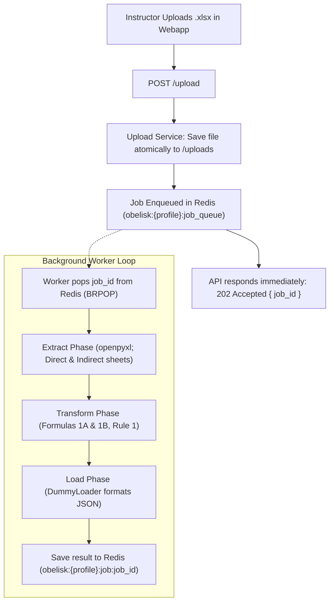
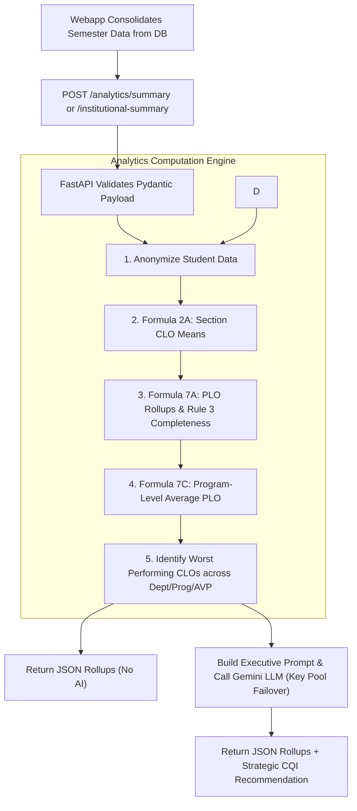

# OBELISK ETL & Analytics Service — End-to-End System Process Explained

> **Purpose of this Document:**  
> The OBELISK Python server is a specialized microservice that operates within a larger educational platform. Because it intentionally separates raw computation from database storage and web authentication, its functions can feel fragmented if viewed in isolation. This document provides a unified, step-by-step explanation of what the system does, how its processes connect, how data flows through it, and where its responsibilities begin and end.

---

## 1. The Big Picture: What This Service Actually Does

The OBELISK Python server is an **authoritative, pure-compute engine** for Outcomes-Based Education (OBE) compliance at Jose Maria College Foundation, Inc. (JMCFI).

It does **not** store student records in a database, manage logins, or render user interfaces. Instead, it performs two distinct data processing jobs:

```
┌───────────────────────────────────────────────────────────────────────────┐
│                                 THE DUAL RESPONSIBILITY                   │
├───────────────────────────────────────────┬───────────────────────────────┤
│         PROCESS 1: PER-COURSE ETL         │      PROCESS 2: INSTITUTIONAL │
│            (Asynchronous / Jobs)          │             ANALYTICS         │
├───────────────────────────────────────────┼───────────────────────────────┤
│ • Ingests AUN-OBE Excel workbooks         │ • Receives consolidated       │
│ • Validates worksheets and markers        │   semester data from webapp   │
│ • Discovers dynamic CLO blocks & rosters  │ • Aggregates CLO means by Dept│
│ • Recomputes Direct Attainment (from raw) │ • Rolls up CLOs into PLO      │
│ • Recomputes Indirect Attainment (rating) │   Attainment (Formulas 7A/7C) │
│ • Evaluates data completeness (Rule 1)    │ • Evaluates program complete  │
│ • Detects learning gaps & generates       │   ness (Rule 3)               │
│   AI CQI recommendations (with failover)  │ • Generates executive AI      │
│                                           │   briefs (with failover)      │
└───────────────────────────────────────────┴───────────────────────────────┘
```

---

## 2. Architectural Boundary: Why It Seems "Fragmented"

If you search the codebase for user tables, database migrations, or login checks, you will find they are either empty scaffolding or completely absent. **This is by design.**

```
┌─────────────────────────────────────────────────────────┐
│                    ELYSIA WEBAPP (TS)                   │
│ • Manages User Logins & Roles (Instructor, Dean, VPAA)  │
│ • Owns Application Database (Postgres / Prisma)         │
│ • Manages Curriculum Map & CLO-to-PLO correlations      │
│ • Handles Course Submission & Approval Workflows        │
│ • Persists Computed Attainment & Audit Logs             │
└──────────────┬──────────────────────────▲───────────────┘
               │ HTTP API Requests        │ JSON Attainment
               │ (Workbooks & Payloads)   │ & Summaries
┌──────────────▼──────────────────────────┴───────────────┐
│             OBELISK PYTHON SERVICE (Port 8000)          │
│ • Pure Compute: No Application DB, No RBAC              │
│ • Redis: Used strictly as a durable task queue          │
│ • Excel Parsing: openpyxl extraction (v2 AUN-OBE)       │
│ • OBE Math: Formulas 1A, 1B, 2A, 7A, 7C, Rules 1 & 3    │
│ • AI/CQI: Multi-key Gemini API pool with failover       │
└─────────────────────────────────────────────────────────┘
```

### Responsibility Matrix

| Feature / Responsibility | Owned by Webapp Backend | Owned by this Python Service |
|---|:---:|:---:|
| User authentication & role checks (RBAC) | **YES** | NO (Trusts calling server) |
| Optional caller secret check (`X-Webapp-Secret`) | Sends header | Validates header |
| Excel file storage & long-term persistence | **YES** | NO (Stores temporarily during job) |
| CLO-to-PLO curriculum mapping definition | **YES** (Prisma / DB) | NO (Retired from Excel) |
| Extracting raw scores from AUN-OBE `.xlsx` | NO | **YES** (`ExcelExtractor`) |
| Calculating Formula 1A (Student Direct CLO %) | NO | **YES** (`SimpleTransformer`) |
| Calculating Formula 1B (Student Indirect CLO %) | NO | **YES** (`SimpleTransformer`) |
| Applying 70% threshold & 4-tier CLO levels | NO | **YES** (`SimpleTransformer`) |
| Rule 1 (Prelim/Midterm/Final completeness) | NO | **YES** (`SimpleTransformer`) |
| Rolling up CLO attainment into PLOs (Formulas 7A/7C)| NO | **YES** (`institutional_summary.py`) |
| Rule 3 (PLO 60% completeness check) | NO | **YES** (`institutional_summary.py`) |
| AI CQI strategic text generation | NO | **YES** (`cqi_recommender.py`) |

---

## 3. Deep Dive: Process 1 — Per-Course Workbook ETL

This is the background process triggered when an instructor uploads a completed Excel class record.

### High-Level Flowchart



### Step-by-Step Breakdown

#### 1. Ingestion (`POST /upload`)
- The instructor submits a `.xlsx` file from the browser.
- The webapp backend streams the multipart upload to Python's `/upload` endpoint.
- Python saves the file into `uploads/` using a temporary `.tmp` extension, renaming atomically on completion to prevent partial reads.
- A job UUID is registered in Redis hash `obelisk:{profile}:job:{job_id}` with `status: "queued"`, and pushed onto the list `obelisk:{profile}:job_queue`.
- The API immediately returns `202 Accepted` with `{ "job_id": "...", "status": "queued" }`. The HTTP connection terminates here.

#### 2. Background Queue Processing (`app/workers/worker.py`)
- Independent `asyncio.Task` worker loops continuously block on `BRPOP obelisk:{profile}:job_queue 2`.
- When a job arrives, its status in Redis is updated to `running`.
- The worker executes the pipeline wrapped in an execution timeout:
  - If successful, it stores `status: "completed"`, `result: { "loaded": ... }` into Redis.
  - If a handled business or validation error occurs, it sets `status: "failed"` and stores a structured error object.
  - If an unexpected crash occurs, it stores a formatted traceback in `error`.
- The temporary uploaded file is deleted from disk in a `finally` block to prevent disk leakage.

#### 3. Client Polling (`GET /jobs/{job_id}`)
- The frontend/webapp polls `GET /jobs/{job_id}` at 1–2 second intervals.
- The response returns `{ "status": "queued" | "running" | "completed" | "failed", "result": ... }`.
- Once `status` is `completed`, the webapp consumes `result.loaded.attainments` and persists the computed numbers into PostgreSQL via Prisma.

#### 4. Optional: Per-Course CQI Advisory (`GET /analytics/jobs/{job_id}/recommendation`)
- Once the ETL job completes, the client may call `GET /analytics/jobs/{job_id}/recommendation`.
- The recommender checks student attainment against the 70% threshold.
- If gaps exist, it anonymizes student identities (`Student A`, `Student B`) and builds an advisory prompt for Google Gemini (`gemini-3.5-flash-lite`).
- Google Gemini responds with structured JSON advisory recommendations with automatic multi-key failover (`OBELISK_LLM_API_KEYS`).

---

## 4. Deep Dive: Process 2 — Institutional Analytics & Executive Summaries

This process runs synchronously and does **not** process Excel spreadsheets. Instead, it accepts pre-aggregated semester payloads from the webapp backend.

### High-Level Flowchart



### Detailed Analytics Stages (`app/analytics/institutional_summary.py`)

#### 1. Student Anonymization
All student names are sanitized to `Student A`, `Student B`, and IDs are stripped before analytics processing.

#### 2. Group Rollups (Department, Program, AVP Group)
Submissions are partitioned using `_generic_aggregator()` into:
- Department summaries (e.g., CITE, CAS, CBA)
- Academic Program summaries (e.g., BSIT, BSCS, BSA)
- Assistant Vice President (AVP) group clusters

#### 3. Formula 2A: Section CLO Attainment (True Mean)
Computes the true arithmetic mean of all student direct CLO attainment percentages in that group:
$$\text{Mean CLO Attainment} = \frac{\sum \text{direct\_clo\_attainment\_pct}}{\text{Total eligible student records}}$$

#### 4. Formula 7A: Per-PLO Attainment Rollup
For every Program Learning Outcome (PLO), finds all CLOs mapped to it across the courses:
$$\text{PLO Attainment (Direct)} = \frac{\sum \text{Mean Attainment of mapped CLOs}}{\text{Total number of mapped CLOs}}$$

#### 5. Rule 3: PLO Data Completeness Standard
Checks whether the underlying data for each PLO is statistically reliable:
$$\text{plo\_completeness\_pct} = \frac{\text{Count of mapped CLOs that satisfied Rule 1}}{\text{Total number of mapped CLOs}}$$
$$\text{plo\_rule3\_met} = (\text{plo\_completeness\_pct} \ge 0.60)$$

#### 6. Formula 7C: Program-Wide PLO Average
Calculated **only** at the Program level:
$$\text{Program PLO Average} = \frac{\sum \text{All individual PLO attainments in program}}{\text{Total number of PLOs in program}}$$

#### 7. Worst-Performing CLO Identification
The engine identifies the 3 lowest-scoring CLOs in each department, program, and AVP group, sorted by lowest attainment percentage and highest student impact.

#### 8. Executive AI Summary (For VPAA Endpoint Only)
- In `POST /analytics/institutional-summary`, the identified worst performers and institutional averages are compiled into an executive-level prompt.
- Google Gemini generates 2–3 high-level strategic interventions for institutional quality improvement.
- Runs with sequential multi-key pool failover; if all keys in `OBELISK_LLM_API_KEYS` are exhausted, returns `"status": "error"` alongside rollups so dashboard data is never lost.

---

## 5. API Reference Summary

| Method | Endpoint | Sync / Async | Audience | Purpose |
|---|---|:---:|---|---|
| `POST` | `/upload` | Async | Instructors | Accepts `.xlsx`, writes to disk, enqueues ETL job in Redis, returns `202 Accepted` |
| `GET` | `/jobs` | Sync | Webapp | Lists all jobs currently tracked in Redis |
| `GET` | `/jobs/{job_id}` | Sync | Webapp | Polling endpoint: returns `queued`, `running`, `completed`, or `failed` with results/errors |
| `GET` | `/analytics/jobs/{job_id}/recommendation` | Sync | Instructors / Chairs | Generates per-course AI CQI recommendation for a completed job |
| `POST` | `/analytics/summary` | Sync | Deans / Chairs / AVPs | Pure numerical OBE rollups (Dept/Prog/AVP); **no AI generated** |
| `POST` | `/analytics/institutional-summary` | Sync | **VPAA Only** | Full institutional rollup + AI executive strategic recommendations |
| `GET` | `/health` | Sync | Monitoring | Simple health and status check |

---

## 6. How Errors are Handled

The service avoids unhandled 500 crashes. All predictable parsing and business logic issues raise subclasses of `OBELISKError`, which generate structured JSON responses:

| Exception Class | Trigger Condition | Details Returned |
|---|---|---|
| `InvalidWorkbook` | Uploaded file cannot be opened as an Excel workbook | `file_path`, `underlying_error` |
| `MissingWorksheet` | Workbook is missing a required sheet (e.g. `Direct CLO`) | `expected_sheet_name`, `available_sheets` |
| `InvalidTemplate` | Marker cell text does not match (e.g. `A1` marker mismatch) | `sheet_name`, `cell`, `expected`, `found` |
| `UnsupportedCourseType` | Workbook cell `B6` in `SETUP` is not `\"LECTURE\"` | `course_type`, `supported_types` |
| `TransformationError` | Invalid record format or computation impossibility | Contextual message |
| `QueueOverloadedError` | Redis job queue has reached its maximum configured capacity | Current queue size, max capacity |
| `UnauthorizedCaller` | Missing or invalid `X-Webapp-Secret` header | `header_name`, `reason` |

### LLM API Key Failover & Exhaustion Handling
When an external LLM call is required:
1. The engine cycles through the keys in `settings.llm_api_keys_list` sequentially.
2. If any individual key fails (e.g., quota exceeded / 429), it issues a structured warning log `llm_key_failed` with the key index and masked preview, then attempts the next key.
3. If all keys fail, it logs `llm_all_keys_exhausted` and returns an error description beginning with `[LLM API ERROR: All N configured API key(s) were exhausted without success...]`.
4. The caller receives a response with `"status": "error"` and the error description in `"error"`.

---

## 7. Current Configurations and Toggles

All configuration is managed in `app/core/config.py` via environment variables (`OBELISK_*` prefix):

* **`OBELISK_REDIS_HOST` & `OBELISK_REDIS_PORT`**: Points to the Redis instance (default `localhost:6379`).
* **`OBELISK_JOB_WORKER_COUNT`**: Number of parallel ETL worker coroutines (default `4`).
* **`OBELISK_WEBAPP_SHARED_SECRET`**: If set, activates `X-Webapp-Secret` verification on protected endpoints.
* **`OBELISK_LLM_API_KEYS`**: List of Google Gemini API keys for live recommendations with automatic failover (supports JSON array e.g. `["key1", "key2"]` or comma-separated `key1,key2`).
* **`OBELISK_LLM_API_KEY`**: Backward-compatible single API key setting.
* **`OBELISK_LLM_MODEL`**: Model string (default `gemini-3.5-flash-lite`).
* **`IS_DEBUG_MODE` in `cqi_recommender.py`**:
  - When `False` (default): Makes real API calls to Google Gemini (`gemini-3.5-flash-lite`) using sequential multi-key failover, returning valid structured JSON recommendations (`summary`, `recommendations`, `pattern`).
  - When `True`: Returns instant deterministic mock CQI JSON responses so the system works offline without API keys.
* **E2E Test Verification (`testing_modules/test_upload_e2e.py`)**:
  - Runs end-to-end tests across both worst-performing (`JMCFI_Class_Record_Template_AUN-OBE(worst).xlsx`) and mixed-attainment (`JMCFI_Class_Record_Template_AUN-OBE(mixed).xlsx`) workbooks.
  - Logs concise CLO gap summaries instead of dumping raw student attainment arrays, avoiding console buffer truncations.
  - Enforces explicit assertions ensuring `recommendation` exists, is non-empty, parses as valid JSON, and contains `summary`, `recommendations`, and `pattern`.
