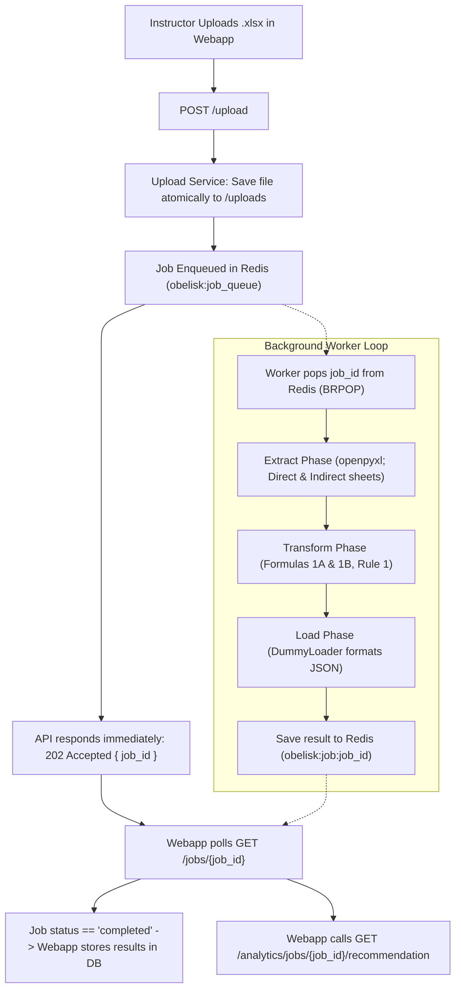
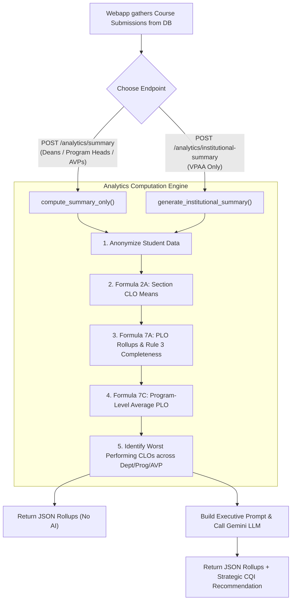

# OBELISK ETL & Analytics Service — End-to-End System Process Explained

> **Purpose of this Document:**  
> The OBELISK Python server is a specialized microservice that operates within a larger educational platform. Because it intentionally separates raw computation from database storage and web authentication, its functions can feel fragmented if viewed in isolation. This document provides a unified, step-by-step explanation of what the system does, how its processes connect, how data flows through it, and where its responsibilities begin and end.

---

## 1. The Big Picture: What This Service Actually Does

The OBELISK Python server is an **authoritative, pure-compute engine** for Outcomes-Based Education (OBE) compliance at Jose Maria College Foundation, Inc. (JMCFI).

It does **not** store student records in a database, manage logins, or render user interfaces. Instead, it performs two distinct data processing jobs:

```
┌─────────────────────────────────────────────────────────────────────────────┐
│                                 THE DUAL RESPONSIBILITY                     │
├───────────────────────────────────────────┬─────────────────────────────────┤
│         PROCESS 1: PER-COURSE ETL         │      PROCESS 2: INSTITUTIONAL   │
│            (Asynchronous / Jobs)          │             ANALYTICS           │
├───────────────────────────────────────────┼─────────────────────────────────┤
│ • Ingests AUN-OBE Excel workbooks         │ • Receives consolidated         │
│ • Validates worksheets and markers        │   semester data from webapp     │
│ • Discovers dynamic CLO blocks & rosters  │ • Aggregates CLO means by Dept  │
│ • Recomputes Direct Attainment (from raw) │ • Rolls up CLOs into PLO        │
│ • Recomputes Indirect Attainment (rating) │   Attainment (Formulas 7A/7C)   │
│ • Evaluates data completeness (Rule 1)    │ • Evaluates program completeness│
│ • Detects learning gaps & generates       │   (Rule 3)                      │
│   AI CQI action recommendations           │ • Generates executive AI briefs │
└───────────────────────────────────────────┴─────────────────────────────────┘
```

---

## 2. Architectural Boundary: Why It Seems "Fragmented"

If you search the codebase for user tables, database migrations, or login checks, you will find they are either empty scaffolding or completely absent. **This is by design.**

```
┌─────────────────────────────────────────────────────────┐
│                    ELYSIA WEBAPP (TS)                   │
│ • Manages User Logins & Roles (Instructor, Dean, VPAA)  │
│ • Owns Application Database (Postgres / Prisma)         │
│ • Manages Curriculum Map & CLO-to-PLO correlations      │
│ • Handles Course Submission & Approval Workflows        │
│ • Persists Computed Attainment & Audit Logs             │
└──────────────┬──────────────────────────▲───────────────┘
               │ HTTP API Requests         │ JSON Attainment
               │ (Workbooks & Payloads)    │ & Summaries
┌──────────────▼──────────────────────────┴───────────────┐
│             OBELISK PYTHON SERVICE (Port 8000)          │
│ • Pure Compute: No Application DB, No RBAC              │
│ • Redis: Used strictly as a durable task queue          │
│ • Excel Parsing: openpyxl extraction (v2 AUN-OBE)       │
│ • OBE Math: Formulas 1A, 1B, 2A, 7A, 7C, Rules 1 & 3    │
│ • AI/CQI: Gap detection & Google Gemini generation      │
└─────────────────────────────────────────────────────────┘
```

### Responsibility Matrix

| Feature / Responsibility | Owned by Webapp Backend | Owned by this Python Service |
|---|:---:|:---:|
| User authentication & role checks (RBAC) | **YES** | NO (Trusts calling server) |
| Optional caller secret check (`X-Webapp-Secret`) | Sends header | Validates header |
| Excel file storage & long-term persistence | **YES** | NO (Stores temporarily during job) |
| CLO-to-PLO curriculum mapping definition | **YES** (Prisma / DB) | NO (Retired from Excel) |
| Extracting raw scores from AUN-OBE `.xlsx` | NO | **YES** (`ExcelExtractor`) |
| Calculating Formula 1A (Student Direct CLO %) | NO | **YES** (`SimpleTransformer`) |
| Calculating Formula 1B (Student Indirect CLO %) | NO | **YES** (`SimpleTransformer`) |
| Applying 70% threshold & 4-tier CLO levels | NO | **YES** (`SimpleTransformer`) |
| Rule 1 (Prelim/Midterm/Final completeness) | NO | **YES** (`SimpleTransformer`) |
| Rolling up CLO attainment into PLOs (Formulas 7A/7C)| NO | **YES** (`institutional_summary.py`) |
| Rule 3 (PLO 60% completeness check) | NO | **YES** (`institutional_summary.py`) |
| AI CQI strategic text generation | NO | **YES** (`cqi_recommender.py`) |

---

## 3. Deep Dive: Process 1 — Per-Course Workbook ETL

This is the background process triggered when an instructor uploads a completed Excel class record.

### High-Level Flowchart



### Detailed Pipeline Stages

#### Step 1: Receiving & Queueing (`app/api/routes/upload.py`)
1. Receives `.xlsx` file via multipart form data.
2. Validates file size (default max: 10MB).
3. Saves file chunk-by-chunk to the local `uploads/` directory with a unique UUID.
4. Generates a new `job_id` and adds the job metadata to Redis with status `queued`.
5. Pushes `job_id` into the Redis queue list (`obelisk:job_queue`).
6. Returns `202 Accepted` with `{ "job_id": "...", "status": "queued" }`. The HTTP connection terminates here without waiting for processing.

#### Step 2: Background Consumption (`app/workers/worker.py`)
- Multiple background worker loops (default: 4 workers) run concurrently.
- Each worker executes a non-blocking `BRPOP` against Redis with a 1-second timeout.
- When a job arrives, the worker marks the job status in Redis as `running`.

#### Step 3: Extraction (`app/etl/extract/extractor.py`)
1. **Workbook Load**: Opens `.xlsx` using `openpyxl` with `data_only=True` to read calculated formula values rather than formulas.
2. **Sheet Verification**: Verifies presence of mandatory worksheets:
   - `Direct CLO`
   - `Indirect CLO`
   - *If either is missing, fails immediately with a structured `MissingWorksheet` error.*
3. **Template Validation**: Checks marker cells (`A1` on both sheets) to ensure the file is an authentic AUN-OBE template. Old templates (with `Database`/`Exam`/`COVERPAGE` sheets) raise structured errors immediately.
4. **Course Type Gating**: If the workbook has a `SETUP` sheet, verifies cell `B6` declares `"LECTURE"`. If any other course type (like `"RESEARCH"`) is present, halts with structured `UnsupportedCourseType` error.
5. **Dynamic CLO Block Discovery**:
   - `Direct CLO`: Scans row 3 starting at Column C (col 3), stepping by 7 columns until an empty cell is encountered.
   - `Indirect CLO`: Scans row 4 starting at Column C (col 3), stepping by 2 columns until an empty cell is encountered.
6. **Dynamic Roster Discovery**: Reads student IDs and names starting from row 5, terminating at the first empty row or known summary-row label (`CLASS AVERAGE`, `MEAN RATING`, `%age CO ATTAINMENT`).
7. **Raw Value Extraction**:
   - Direct: Extracts 6 raw cells per block: Prelim Score/Max, Midterm Score/Max, Final Score/Max. (Never reads the Excel "Attainment %" formula column).
   - Indirect: Extracts raw Likert Rating (1–5) per block. (Never reads the Excel "Attainment %" formula column).
8. **CLO-PLO Mapping**: CLO-PLO mapping is permanently retired from python-server; returns an empty list `[]`.

#### Step 4: Transformation (`app/etl/transform/transformer.py`)
1. **Formula 1A Calculation (Direct CLO Attainment)**:
   Recomputed independently from the raw scores:
   $$\text{direct\_clo\_attainment\_pct} = \frac{\text{Prelim Score} + \text{Midterm Score} + \text{Final Score}}{\text{Prelim Max} + \text{Midterm Max} + \text{Final Max}}$$
2. **Formula 1B Calculation (Indirect CLO Attainment)**:
   Recomputed independently from the survey rating:
   $$\text{indirect\_clo\_attainment\_pct} = \left(\frac{\text{Rating}}{5.0}\right) \times 100$$
3. **Institutional Threshold Evaluation**:
   - Compares the attainment percentage against the fixed institutional standard:
     $$\text{met\_threshold} = (\text{direct\_clo\_attainment\_pct} \ge 0.70)$$
4. **4-Tier CLO Attainment Level**:
   - $\ge 85\%$ $\rightarrow$ **Exceptional**
   - $70\% - 84\%$ $\rightarrow$ **Proficient**
   - $60\% - 69\%$ $\rightarrow$ **Basic**
   - $< 60\%$ $\rightarrow$ **Below Basic**
5. **Rule 1: Assessment Completeness**:
   - Checks if the student has recorded scores in **PRELIM**, **MIDTERM**, and **FINAL** periods for that specific CLO.
   - Flags `is_record_complete = true/false`.
   - Computes section-level completeness percentage (`section_completeness_pct`) and flags `rule1_met = (section_completeness_pct >= 0.60)`.
6. **Output Shape Stability**: `excluded_reason` is set to `null` across all rows.
7. **Formula Versioning**: Computes a deterministic SHA-256 hash representing the formula configuration for audit traceability.

#### Step 5: Loading & Completion (`app/etl/load/loader.py`)
1. Formats the data into the canonical output JSON envelope:
   ```json
   {
     "loaded": {
       "header": { "course_code": "GE 1", ... },
       "attainments": [ ... ],
       "clo_plo_mapping": []
     }
   }
   ```
2. Updates Redis job entry to `completed` with the result payload.
3. If an error occurred anywhere in the pipeline, the worker catches the `OBELISKError`, serializes its structured JSON (`error_type`, `message`, `details`), and sets status to `failed`.

#### Step 6: Per-Course CQI Advisory (`GET /analytics/jobs/{job_id}/recommendation`)
- Once the job is `completed`, the webapp can request an AI recommendation for that specific course.
- Scans `attainments` for any CLO where students failed to meet the 70% threshold.
- Replaces student names with anonymized placeholders (`Student A`, `Student B`) to protect privacy.
- Calls Google Gemini using the `google-genai` SDK (`gemini-3.6-flash`).
- Returns structured Markdown with **Summary**, **Findings**, **Recommendations**, and **Pattern Flagged**.

---

## 4. Deep Dive: Process 2 — Institutional & Program Analytics

This process runs when academic leaders (Deans, Program Heads, VPAA) view multi-course OBE rollups across departments or entire programs.

Unlike the ETL pipeline, this process is **synchronous**: the webapp sends a consolidated payload of pre-computed course submissions, and the service returns rolled-up analytics immediately.



### Detailed Analytics Stages (`app/analytics/institutional_summary.py`)

#### 1. Student Anonymization
All student names are sanitized to `Student A`, `Student B`, and IDs are stripped before analytics processing.

#### 2. Group Rollups (Department, Program, AVP Group)
Submissions are partitioned using `_generic_aggregator()` into:
- Department summaries (e.g., CITE, CAS, CBA)
- Academic Program summaries (e.g., BSIT, BSCS, BSA)
- Assistant Vice President (AVP) group clusters

#### 3. Formula 2A: Section CLO Attainment (True Mean)
Computes the true arithmetic mean of all student direct CLO attainment percentages in that group:
$$\text{Mean CLO Attainment} = \frac{\sum \text{direct\_clo\_attainment\_pct}}{\text{Total eligible student records}}$$

#### 4. Formula 7A: Per-PLO Attainment Rollup
For every Program Learning Outcome (PLO), finds all CLOs mapped to it across the courses:
$$\text{PLO Attainment (Direct)} = \frac{\sum \text{Mean Attainment of mapped CLOs}}{\text{Total number of mapped CLOs}}$$

#### 5. Rule 3: PLO Data Completeness Standard
Checks whether the underlying data for each PLO is statistically reliable:
$$\text{plo\_completeness\_pct} = \frac{\text{Count of mapped CLOs that satisfied Rule 1}}{\text{Total number of mapped CLOs}}$$
$$\text{plo\_rule3\_met} = (\text{plo\_completeness\_pct} \ge 0.60)$$

#### 6. Formula 7C: Program-Wide PLO Average
Calculated **only** at the Program level:
$$\text{Program PLO Average} = \frac{\sum \text{All individual PLO attainments in program}}{\text{Total number of PLOs in program}}$$

#### 7. Worst-Performing CLO Identification
The engine identifies the 3 lowest-scoring CLOs in each department, program, and AVP group, sorted by lowest attainment percentage and highest student impact.

#### 8. Executive AI Summary (For VPAA Endpoint Only)
- In `POST /analytics/institutional-summary`, the identified worst performers and institutional averages are compiled into an executive-level prompt.
- Google Gemini generates 2–3 high-level strategic interventions for institutional quality improvement.

---

## 5. API Reference Summary

| Method | Endpoint | Sync / Async | Audience | Purpose |
|---|---|:---:|---|---|
| `POST` | `/upload` | Async | Instructors | Accepts `.xlsx`, writes to disk, enqueues ETL job in Redis, returns `202 Accepted` |
| `GET` | `/jobs` | Sync | Webapp | Lists all jobs currently tracked in Redis |
| `GET` | `/jobs/{job_id}` | Sync | Webapp | Polling endpoint: returns `queued`, `running`, `completed`, or `failed` with results/errors |
| `GET` | `/analytics/jobs/{job_id}/recommendation` | Sync | Instructors / Chairs | Generates per-course AI CQI recommendation for a completed job |
| `POST` | `/analytics/summary` | Sync | Deans / Chairs / AVPs | Pure numerical OBE rollups (Dept/Prog/AVP); **no AI generated** |
| `POST` | `/analytics/institutional-summary` | Sync | **VPAA Only** | Full institutional rollup + AI executive strategic recommendations |
| `GET` | `/health` | Sync | Monitoring | Simple health and status check |

---

## 6. How Errors are Handled

The service avoids unhandled 500 crashes. All predictable parsing and business logic issues raise subclasses of `OBELISKError`, which generate structured JSON responses:

| Exception Class | Trigger Condition | Details Returned |
|---|---|---|
| `InvalidWorkbook` | Uploaded file cannot be opened as an Excel workbook | `file_path`, `underlying_error` |
| `MissingWorksheet` | Workbook is missing a required sheet (e.g. `Direct CLO`) | `expected_sheet_name`, `available_sheets` |
| `InvalidTemplate` | Marker cell text does not match (e.g. `A1` marker mismatch) | `sheet_name`, `cell`, `expected`, `found` |
| `UnsupportedCourseType` | Workbook cell `B6` in `SETUP` is not `"LECTURE"` | `course_type`, `supported_types` |
| `TransformationError` | Invalid record format or computation impossibility | Contextual message |
| `QueueOverloadedError` | Redis job queue has reached its maximum configured capacity | Current queue size, max capacity |
| `UnauthorizedCaller` | Missing or invalid `X-Webapp-Secret` header | `header_name`, `reason` |

---

## 7. Current Configurations and Toggles

All configuration is managed in `app/core/config.py` via environment variables (`OBELISK_*` prefix):

* **`OBELISK_REDIS_HOST` & `OBELISK_REDIS_PORT`**: Points to the Redis instance (default `localhost:6379`).
* **`OBELISK_JOB_WORKER_COUNT`**: Number of parallel ETL worker coroutines (default `4`).
* **`OBELISK_WEBAPP_SHARED_SECRET`**: If set, activates `X-Webapp-Secret` verification on protected endpoints.
* **`OBELISK_LLM_API_KEY`**: API key for Google Gemini.
* **`IS_DEBUG_MODE` in `cqi_recommender.py`**:
  - When `True` (default): Returns instant mock CQI responses so the system works completely offline without API keys.
  - When `False`: Makes real API calls to Google Gemini (`gemini-3.6-flash`).
