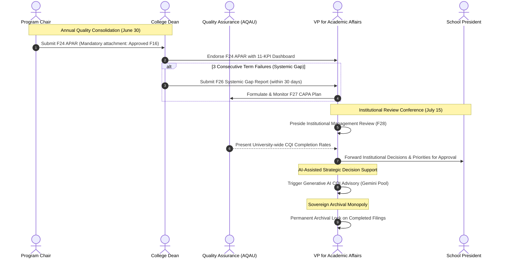

# OBELISK: Comprehensive Forms Inventory & End-to-End Workflow Guide

> **Document Code:** `SYS-DOC-FWVL-01`  
> **Document Status:** Authoritative System Specification & Workflow Blueprint  
> **Scope:** Jose Maria College Foundation, Inc. (JMCFI) — Outcomes-Based Educational Learning and Intelligent System Kit (OBELISK)  
> **Cross-References:**  
> - [`JMCFI-WIN-OBE-Forms-Digitization-Reference.md`](file:///D:/Jetbrains_IDE_Projects/pycharm/Obelisk_FINAL/system-docs/JMCFI-WIN-OBE-Forms-Digitization-Reference.md)  
> - [`SYSTEM_PROCESS_EXPLAINED.md`](file:///D:/Jetbrains_IDE_Projects/pycharm/Obelisk_FINAL/system-docs/SYSTEM_PROCESS_EXPLAINED.md)  
> - [`SYSTEM_PURPOSE_AND_VALUE_MAPPING.md`](file:///D:/Jetbrains_IDE_Projects/pycharm/Obelisk_FINAL/system-docs/SYSTEM_PURPOSE_AND_VALUE_MAPPING.md)  
> - [`Synchronization_of_documents_and_system.md`](file:///D:/Jetbrains_IDE_Projects/pycharm/Obelisk_FINAL/system-docs/Synchronization_of_documents_and_system.md)  
> - [`approval-routes.ts`](file:///D:/Jetbrains_IDE_Projects/pycharm/Obelisk_FINAL/apps/backend/lib/forms/approval-routes.ts)

---

## 1. Executive Summary & Purpose

In accordance with JMCFI's institutional **WIN-OBE Assessment Plan** and CHED CMO No. 46, s. 2012, academic programs must adhere to an unbroken 8-level outcomes hierarchy:

$$\text{Institutional Mission/Vision} \longrightarrow \text{Core Values} \longrightarrow \text{Institutional Outcomes (IO)} \longrightarrow \text{PEOs} \longrightarrow \text{PLOs} \longrightarrow \text{CLOs} \longrightarrow \text{TLA/AT} \longrightarrow \text{Rubric Scoring}$$

OBELISK digitizes the operational lifecycle of this framework across all four **Plan–Do–Check–Act (PDCA)** phases. This document serves as the master catalog and workflow blueprint, defining:
1. The **complete inventory of institutional forms** (F01–F28 fully specified in manual, F29–F37/F41 placeholders, and client-mandated extensions such as the At-Risk Action-Taken Record).
2. The **chronological operational sequence** of academic assessment from beginning-of-term curriculum planning to end-of-year executive governance.
3. The **exact approval routing chains** from Faculty Preparers through Program Chairs, College Deans, and the Academic Quality Assurance Unit (AQAU), culminating at the **Vice President for Academic Affairs (VPAA)**.
4. The **data flow and mathematical transformation gates** that connect classroom evidence to institutional accreditation records.

---

## 2. Complete Inventory of Forms in OBELISK

Every form in OBELISK adheres to standardized component structures:
- **Standard Header:** Organization name, Form Code & Title (`WIN-OBE-F##`), PDCA phase, evidence type, retention policy, responsible party chain, and purpose statement.
- **Standard Footer:** Two-column signature block (Preparer/Submitter vs. Approver/Receiver) and academic year/page markings.
- **Workflow State Machine:** Uniform transitions (`draft` $\to$ `submitted` $\to$ `under_review` $\to$ `approved` / `returned_with_comments` $\to$ `archived`).

### 2.1 The Master 29-Form System Registry

Below is the complete inventory of the 28 manual forms plus the client-mandated remediation record (Sequence 35), mapped to the backend registry [`approval-routes.ts`](file:///D:/Jetbrains_IDE_Projects/pycharm/Obelisk_FINAL/apps/backend/lib/forms/approval-routes.ts):

| Form ID | Official Form Title | Codebase Key | PDCA Phase | Retention | Preparer Roles | Canonical Approver Chain | Operational Role & Summary |
| :--- | :--- | :--- | :---: | :---: | :--- | :--- | :--- |
| **F01** | CLO-PLO Curriculum Map | `curriculum_map` | PLAN | Permanent | `program_chair`, `faculty` | `['aqau']` | Maps courses to PLOs with I-P-D levels; auto-checks 'D' coverage. |
| **F02** | Portfolio Roadmap & Rubric Standards | `portfolio_roadmap` | PLAN | Permanent | `program_chair`, `faculty` | `['dean', 'aqau']` | 4-year cumulative portfolio milestones, rubrics, and calibration. |
| **F03** | Assessment Calendar with Cohort Milestones | `assessment_calendar` | PLAN | 5 Years | `program_chair` | `['dean', 'aqau']` | Pre-seeded with 17 non-deletable institutional milestones. |
| **F04** | Target-Setting Matrix (Cohort Benchmarks) | `target_setting_matrix` | PLAN | 5 Years | `program_chair`, `dean` | `['aqau']` | Sets target % per PLO/CLO; strictly enforces $\ge 70.0\%$ floor. |
| **F05** | Stakeholder Consultation Records | `stakeholder_consultation` | PLAN | 5 Years | `program_chair`, `faculty`, `dean` | `['program_chair']` | Gathers advisory input from PAC, employers, alumni, students. |
| **F06** | Approved Assessment Budget | `assessment_budget` | PLAN | 5 Years | `dean` | `['vpaa']` | 12 fixed PDCA budget line items; submitted by Dean to VPAA. |
| **F07** | Per-Student CLO Raw Data Sheet | `clo_raw_data` | DO | 5 Years | `faculty`, `program_chair` | `['program_chair']` | Primary gradebook ETL ingest; Formula 1A/1B; auto-flags at-risk. |
| **F08** | Mid-Cycle CLO Attainment Summary | `mid_cycle_attainment` | DO/CHECK | 5 Years | `faculty` | `['program_chair']` | Formative & midterm CLO snapshot; mid-term at-risk watchlist. |
| **F09** | Resource Acquisition & CQI Monitoring | `resource_monitoring` | DO | 5 Years | `dean`, `program_chair` | `['vpaa']` | Tracks F06 budget expenditure and F23 CQI implementation. |
| **F10** | Peer Observation Record | `peer_observation` | DO | 5 Years | `program_chair`, `faculty` | `['program_chair']` | 7-dimension OBE syllabus and pedagogy classroom observation. |
| **F11** | Portfolio Exhibition Industry Feedback | `exhibition_feedback` | DO/CHECK | 5 Years | `program_chair`, `faculty` | `['program_chair']` | External industry practitioner scoring (10-point scale) at Y4 expo. |
| **F12** | CLO Achievement Perception Survey | `clo_perception_survey` | DO/CHECK | 5 Years | `program_chair`, `faculty` | `['program_chair']` | Student indirect Likert survey; flags divergence $\ge 20$ pts vs direct. |
| **F13** | Course Assessment Report (CAR) | `course_assessment_report` | CHECK | 5 Years | `faculty` | `['program_chair', 'dean', 'aqau']` | Central 7-part operational hub combining exams, rubrics, tasks, CQI. |
| **F14** | CLO Attainment Summary (Full Term) | `clo_attainment_summary` | CHECK | 5 Years | `faculty` | `['program_chair']` | Consolidates section-level CLO performance by year cohort. |
| **F15** | PLO Attainment Summary (Program Level) | `plo_attainment_summary` | CHECK | 5 Years | `program_chair` | `['dean', 'aqau']` | Formula 7A rollup linking database CLO-PLO mappings. |
| **F16** | Cohort CLO/PLO Attainment Tracking Sheet | `cohort_tracking` | CHECK | Permanent | `program_chair` | `['aqau']` | Longitudinal 4-year cohort matrix with automated trend arrows. |
| **F17** | Student Exit Survey Tabulation | `student_exit_survey` | CHECK | 5 Years | `program_chair`, `faculty` | `['program_chair']` | End-of-term student indirect rating across all PLOs by cohort. |
| **F18** | Portfolio Assessment Record | `portfolio_assessment_record` | CHECK | 5 Years | `faculty`, `program_chair` | `['aqau']` | Faculty + Industry panel scoring for Y1–Y4 portfolio milestones. |
| **F19** | Capstone Panel Evaluation Sheet | `capstone_panel_evaluation` | CHECK | 5 Years | `faculty`, `program_chair` | `['program_chair', 'aqau']` | Primary Y4 culminating evidence; min 2 faculty + 1 industry panelist. |
| **F20** | Alumni Tracer Study Report | `alumni_tracer` | CHECK | Permanent | `program_chair`, `faculty` | `['program_chair', 'dean']` | Biennial post-grad employment & PEO sufficiency tracking. |
| **F21** | Employer Satisfaction Survey Report | `employer_satisfaction_survey` | CHECK | Permanent | `program_chair`, `faculty` | `['program_chair', 'dean']` | Biennial industry feedback on graduate competence in workplace. |
| **F22** | PLO Attainment Report with Gap Analysis | `plo_gap_analysis` | ACT | 5 Years | `program_chair` | `['dean']` | Identifies $< 70\%$ PLO-cohort combinations; assigns 6 root causes. |
| **F23** | CQI Action Plan | `cqi_action_plan` | ACT | 5 Years | `program_chair` | `['dean', 'aqau']` | 2-phase living record: planned interventions $\to$ tracked outcomes. |
| **F24** | Annual Program Assessment Report (APAR)| `annual_program_report` | ACT | Permanent | `program_chair` | `['dean', 'vpaa']` | 11-KPI dashboard; due June 30; gated strictly on approved F16. |
| **F25** | Closing-the-Loop (CTL) Report | `closing_the_loop` | ACT | Permanent | `program_chair` | `['aqau']` | Verifies 5 mandatory conditions; computes hard `closed` status. |
| **F26** | Systemic Gap Report | `systemic_gap_report` | ACT | Permanent | `dean` | `['vpaa']` | Triggered by 3 consecutive cycle failures; due in 30 days. |
| **F27** | Corrective & Preventive Action (CAPA) | `capa_plan` | ACT | Permanent | `dean`, `vpaa` | `['aqau']` | Executive structural interventions approved by VPAA, monitored by AQAU. |
| **F28** | Institutional Management Review Records | `institutional_review` | ACT | Permanent | `aqau`, `vpaa` | `['vpaa']` | Annual executive review (July 15) presided by VPAA with President. |
| **Seq 35**| Action-Taken Record (At-Risk Remediation) | `action_taken` | ACT | 5 Years | `faculty`, `program_chair` | `['program_chair']` | Intervention log for $< 70\%$ students; approval deletes AtRiskFlags. |

### 2.2 Unspecified / Placeholder Forms in the WIN-OBE Manual
The manual references additional schedules that do not have standardized field structures defined:
- **F29**: Specialty / Consolidation Form (Placeholder)
- **F30B, F30C, F30D**: Specialized Department Evaluation Matrices & Rubric Banks
- **F31–F37**: Multi-Section Consolidation Schedules, Course Pack Audits, Lab Inventory, Clinical Schedules
- **F41**: Special Periodic Assessment Audit

---

## 3. High-Level Forms Workflow Across the PDCA Cycle

The flow of forms represents a closed feedback loop where raw student learning evidence is captured, aggregated, evaluated, and channeled through administrative checkpoints to the VPAA:

```mermaid
flowchart TD
    subgraph PHASE1["1. PLAN (Pre-Semester Setup)"]
        F01["F01: Curriculum Map\n(Chair \u2192 AQAU)"]
        F02["F02: Portfolio Roadmap\n(Chair \u2192 Dean \u2192 AQAU)"]
        F03["F03: Assessment Calendar\n(Chair \u2192 Dean \u2192 AQAU)"]
        F04["F04: Target Setting\n(Chair/Dean \u2192 AQAU)"]
        F06["F06: Assessment Budget\n(Dean \u2192 VPAA)"]
    end

    subgraph PHASE2["2. DO (Instruction & Ingest)"]
        F07["F07: Class Record Upload / Raw Data\n(Faculty \u2192 Chair)"]
        F08["F08: Mid-Cycle Summary\n(Faculty \u2192 Chair)"]
        F10["F10: Peer Observation\n(Senior Faculty \u2192 Chair)"]
        F11["F11: Exhibition Feedback\n(Liaison \u2192 Chair)"]
        F12["F12: Perception Survey\n(Office \u2192 Chair)"]
    end

    subgraph PHASE3["3. CHECK (Rollups & Evaluation)"]
        F13["F13: Course Assessment Report (CAR)\n(Faculty \u2192 Chair \u2192 Dean \u2192 AQAU)"]
        F14["F14: Full-Term CLO Summary\n(Faculty \u2192 Chair)"]
        F15["F15: Program PLO Summary\n(Chair \u2192 Dean \u2192 AQAU)"]
        F16["F16: Longitudinal Cohort Tracking\n(Chair \u2192 AQAU)"]
        F17["F17: Exit Survey Tabulation\n(Office \u2192 Chair)"]
        F18["F18: Portfolio Assessment\n(Panel \u2192 AQAU)"]
        F19["F19: Capstone Panel Evaluation\n(Panel \u2192 Chair \u2192 AQAU)"]
        F20["F20: Alumni Tracer (Biennial)\n(Office \u2192 Chair \u2192 Dean)"]
        F21["F21: Employer Survey (Biennial)\n(Liaison \u2192 Chair \u2192 Dean)"]
    end

    subgraph PHASE4["4. ACT (Remediation & CQI Loop)"]
        ACT_RISK["Action-Taken Record (Seq 35)\n(Faculty \u2192 Chair)"]
        F22["F22: PLO Gap Analysis\n(Chair \u2192 Dean)"]
        F23["F23: CQI Action Plan\n(Chair \u2192 Dean \u2192 AQAU)"]
        F25["F25: Closing-the-Loop Report\n(Chair \u2192 AQAU)"]
    end

    subgraph PHASE5["5. EXECUTIVE GOVERNANCE & VPAA FINALIZATION"]
        F24["F24: Annual Program Report (APAR)\n(Chair \u2192 Dean \u2192 VPAA)"]
        F26["F26: Systemic Gap Report (3x Failure)\n(Dean \u2192 VPAA)"]
        F27["F27: CAPA Plan\n(Dean/VPAA \u2192 AQAU)"]
        F28["F28: Institutional Review (July 15)\n(AQAU/VPAA \u2192 President)"]
        AI_GEN["AI Strategic Advisory Insights\n(VPAA Trigger Only)"]
        ARCHIVE["Permanent Historical Archival\n(VPAA / Admin Monopoly)"]
    end

    %% Relational Connections
    F01 --> F04
    F01 --> F13
    F03 -.->|Milestone Governance| F07
    F06 -->|Funding Approval| PHASE2
    
    F07 -->|Formula 1A / At-Risk Flags| F13
    F07 --> F08
    F08 & F10 & F11 & F12 --> F13
    
    F13 --> F14
    F13 -.->|At-Risk Watchlist| ACT_RISK
    ACT_RISK -->|Approval Clears Flags| F13
    
    F14 --> F15
    F15 --> F16
    F17 & F18 & F19 --> F15
    F20 & F21 -.->|Indirect Weight (30%)| F15
    
    F15 --> F22
    F22 --> F23
    F23 --> F25
    F23 -.->|Monitored in F09| PHASE2
    
    F16 -->|Mandatory Attachment Gate| F24
    F25 -->|CTL Evidence Attached| F24
    F24 --> F28
    
    F16 -.->|3 Consecutive Failures| F26
    F26 --> F27
    F27 --> F28
    
    F28 --> AI_GEN
    F24 & F25 & F27 & F28 --> ARCHIVE
```

---

## 4. Detailed Step-by-Step Forms Workflow (Leading to VPAA)

### Step 1: Pre-Semester Institutional Planning (PLAN Phase)
1. **Curriculum Mapping (F01):** The Program Chair (assisted by Faculty) establishes the CLO-to-PLO mapping grid. Every PLO is assigned its Introduced (I), Practiced (P), or Demonstrated (D) courses. The system automatically computes a **Coverage Check** requiring at least one 'D' stage course per PLO. The form routes to **AQAU** for accreditation compliance verification.
2. **Assessment Calendar (F03):** The Program Chair establishes the semester timeline. OBELISK pre-populates 17 non-deletable institutional milestones (orientation, midterms, finals, CAR submission deadline, APAR deadline). Routes to **Dean $\to$ AQAU**.
3. **Target Setting (F04):** The Program Chair and Dean set performance targets for each PLO and CLO by year-level cohort. The system strictly enforces the **$\ge 70.0\%$ institutional floor** (`TargetBelowFloorError` HTTP 409). Routes to **AQAU**.
4. **Portfolio Roadmap (F02, if applicable):** Portfolio-based programs map 4-year deliverables and panel rubric criteria. Routes to **Dean $\to$ AQAU**.
5. **Assessment Budget Formulation (F06):** The College Dean compiles estimated costs across 12 standardized PDCA activities (industry honoraria, external panels, tracer surveys). **The Dean submits F06 directly to the VPAA for financial authorization.**

---

### Step 2: Classroom Execution & Data Ingest (DO Phase)
1. **Class Record Upload (F07):** Throughout and at the end of the term, instructors upload standard AUN-OBE Excel gradebooks or CSV rosters to `/forms/clo-raw-data`.
2. **Pure Mathematical ETL Extraction:** The Python backend parses raw scores via `openpyxl`:
   - **Formula 1A:** Computes independent Direct CLO Attainment:
     $$\text{direct\_clo\_attainment\_pct} = \frac{\text{Prelim} + \text{Midterm} + \text{Final}}{\text{Prelim Max} + \text{Midterm Max} + \text{Final Max}} \times 100$$
   - **Rule 1 Completeness:** Checks score presence across Prelim, Midterm, and Final ($\ge 60\%$ section threshold).
   - **Automatic At-Risk Identification:** Any student scoring $< 70.0\%$ on any CLO is automatically flagged and inserted into the `AtRiskFlag` database table.
3. **Mid-Cycle Check & Formative Feedback (F08, F10, F11, F12):**
   - Faculty summarize mid-cycle performance and at-risk students on **F08** (submitted to Chair).
   - Peer observations are logged on **F10** (7 OBE alignment criteria).
   - Portfolio exhibitions (F11) and perception surveys (F12) gather student and industry feedback.

---

### Step 3: Course Assessment, Remediation & Section Rollup (CHECK Phase)
1. **Course Assessment Report (CAR / F13):** Faculty generate the 7-part CAR hub:
   - Part 1: Course identification and enrollment statistics.
   - Part 2: Assessment category means (Exams, Rubrics, Performance Tasks, Portfolios).
   - Part 3: Year-level cohort CLO attainment summaries.
   - Part 4: At-risk student watchlist populated directly from database flags.
   - Part 5–7: Root cause analysis, instructional strategies, and CQI proposals.
   - **Approval Routing:** Submitted by **Faculty $\to$ Program Chair $\to$ Dean $\to$ AQAU**.
2. **At-Risk Student Remediation (Action-Taken Record / Seq 35):**
   - For every student on the F13 Part 4 watchlist, the instructor files an Action-Taken Record documenting tutoring, re-assessment, or academic advising.
   - **Approval & Flag Clearance:** Submitted to the **Program Chair**. Upon final approval, an atomic PostgreSQL transaction triggers `approval-effects.ts`, deleting the `AtRiskFlag` records for the remediated students.
3. **Full-Term CLO Summary (F14):** Faculty consolidate final section-level attainments. Submitted to **Program Chair**.

---

### Step 4: Program-Wide Rollup & Longitudinal Tracking (CHECK Phase)
1. **PLO Attainment Summary (F15):**
   - OBELISK queries `prisma.cloToPloMap` for all active course sections and transmits attainment snapshots to the Python analytics engine.
   - **Formula 7A:** Aggregates mapped CLO averages into Program Learning Outcomes:
     $$\text{PLO Attainment} = \frac{\sum_{\text{mapped CLOs}} \text{Mean Attainment}}{\text{Total Mapped CLOs}}$$
   - **Approval Routing:** Prepared by **Program Chair $\to$ Dean $\to$ AQAU**.
2. **Cohort Tracking Sheet (F16):**
   - Longitudinal tracking across 4 academic years. Pure function `buildCohortLines` computes trend indicators ($\uparrow, \downarrow, \rightarrow$) and triggers CQI alerts for declining cohorts.
   - **Permanent retention record.** Submitted by **Program Chair $\to$ AQAU**.
3. **Indirect Instruments Consolidation (F17, F18, F19, F20, F21):**
   - Graduating classes complete exit surveys (**F17**).
   - Portfolios (**F18**) and Capstones (**F19**) are evaluated by multi-member panels with required industry practitioner participation.
   - Biennial Alumni Tracer (**F20**) and Employer Satisfaction (**F21**) reports evaluate Program Educational Objectives (PEOs).

---

### Step 5: Continuous Quality Improvement Loop (ACT Phase)
1. **PLO Gap Analysis (F22):** For any PLO-cohort combination falling below $70.0\%$, the Program Chair generates an F22 report, categorizing deficiencies into the **6 Accredited Root Causes**:
   1. *Curriculum Structure & Prerequisite Flow*
   2. *Instructional Delivery & Pedagogy*
   3. *Assessment Strategy & Tool Validity*
   4. *Student Readiness & Academic Background*
   5. *Learning Resources & Physical/Virtual Facilities*
   6. *Institutional Support & Administrative Policies*
   - Routes from **Program Chair $\to$ Dean**.
2. **CQI Action Plan (F23):** The Program Chair translates F22 gaps into binding action items with named owners, measurable KPIs, and completion deadlines. Routes from **Program Chair $\to$ Dean $\to$ AQAU**.
3. **Closing-the-Loop Report (F25):** At the conclusion of the following academic cycle, the Program Chair reviews implemented interventions. OBELISK evaluates the **Five Mandatory Loop Closure Conditions**:
   - *Condition 1:* Assessment method aligned with Bloom's taxonomy.
   - *Condition 2:* Statistically representative student sample size.
   - *Condition 3:* Intervention implemented exactly as approved.
   - *Condition 4:* Re-assessment attainment achieves the $\ge 70.0\%$ benchmark.
   - *Condition 5:* Documentary evidence attached.
   - The system **hard-computes** the status: `CLOSED` only if all 5 conditions are verified; otherwise `OPEN_REASSESS` or `OPEN_NOT_IMPLEMENTED`. Routes to **AQAU**.

---

### Step 6: Executive Synthesis, Escalations & The VPAA Final Stage

The entire system converges upon the **Office of the Vice President for Academic Affairs (VPAA)**:



#### 1. Annual Program Assessment Report (APAR / F24) — Due June 30
- The definitive annual rollup for the degree program.
- Compiles the **11-KPI Program Performance Dashboard** (PLO attainment, cohort progression, capstone pass rate, exit survey satisfaction, CQI completion rate).
- **Submission Gate:** The system blocks submission if the Permanent **F16 Cohort Tracking Sheet** is not attached and approved.
- **Routing:** Prepared by **Program Chair $\longrightarrow$ Endorsed by Dean $\longrightarrow$ Approved by VPAA**.

#### 2. Systemic Gap Escalation (F26) & CAPA Planning (F27)
- **F26 Trigger:** If an outcome remains below the 70% threshold across **3 consecutive cycles**, standard department-level CQI is deemed ineffective.
- Within 30 days of the third failure, the **Dean must submit Form F26 directly to the VPAA**.
- **F27 CAPA Plan:** The Dean and VPAA formulate structural corrective actions (curriculum restructuring, faculty hiring/retraining, equipment budgets). Monitored semestrally or annually by **AQAU** until benchmark is sustained for 2+ consecutive cycles.

#### 3. Institutional Management Review (F28) — July 15
- The apex annual quality review meeting.
- **Presided over by the VPAA**, with the QA Director (AQAU) and all College Deans present.
- Reviews program APAR compliance, institutional CQI completion rates (target $\ge 70\%$), and pending CAPA plans.
- Form F28 is endorsed by the VPAA and **formally approved by the School President**.

#### 4. Exclusive VPAA Strategic AI Decision Support
- OBELISK embeds a Google Gemini AI recommendation engine equipped with a multi-key failover pool.
- **Authorization Gate:** Access to generate institutional strategic insights (`POST /api/v1/ai/recommendation/generate`) is strictly restricted to the **VPAA** and **system_admin** (`assertCanGenerateAiInsights`).
- Before prompts are compiled, student PII is scrubbed (`anonymize_students`), ensuring complete compliance with the Data Privacy Act of 2012 (RA 10173). Recommendations write exclusively to table `AiRecommendation` in `pending_review` status for executive evaluation.

#### 5. Sovereign VPAA Archival Monopoly
- In alignment with institutional governance, the authority to archive approved forms into permanent, immutable historical storage is restricted strictly to the **VPAA** and **system_admin** (`assertCanArchive` in [`approval-routes.ts`](file:///D:/Jetbrains_IDE_Projects/pycharm/Obelisk_FINAL/apps/backend/lib/forms/approval-routes.ts) and `FEATURE_ACCESS.archive` in [`role-access.ts`](file:///D:/Jetbrains_IDE_Projects/pycharm/Obelisk_FINAL/apps/backend/lib/role-access.ts)).
- While AQAU and Deans can approve forms, only the VPAA can execute the final archive transition (`status = 'archived'`), locking the records against all future modifications for PACUCOA and CHED audits.

---

## 5. Summary Role Responsibility Matrix

| Operational Role | Primary Forms Prepared | Forms Reviewed & Approved | Exclusive System Privileges & Gates |
| :--- | :--- | :--- | :--- |
| **Faculty** | F07 (Raw Ingest), F08 (Mid-Cycle), F10 (Peer Obs), F12 (Perception), F13 (CAR), F14 (CLO Summary), Action-Taken (Seq 35) | *None (Faculty is strictly a Preparer)* | Uploads class records, initiates early at-risk remediation. |
| **Program Chair** | F01 (Map), F02 (Roadmap), F03 (Calendar), F04 (Targets), F11 (Exhibition), F15 (PLO Summary), F16 (Tracking), F22 (Gaps), F23 (CQI), F24 (APAR), F25 (CTL) | F07, F08, F10, F11, F12, F13, F14, Action-Taken (Seq 35) | Endorses class records, approves Action-Taken records (clearing at-risk flags), owns program-level rollups. |
| **College Dean** | F04 (Targets), F06 (Assessment Budget), F09 (Resource Monitoring), F26 (Systemic Gap), F27 (CAPA) | F02, F03, F13, F15, F20, F21, F22, F23, F24 | **Sole custody of PLO management** (create, edit, retire PLOs); endorses APAR; submits budget & systemic gaps to VPAA. |
| **AQAU (Quality Assurance)** | F28 (Institutional Review, co-prepared with VPAA) | F01, F02, F03, F04, F13, F15, F16, F18, F19, F23, F25, F27 | Institution-wide compliance radar; enforces 5-condition Closing-the-Loop (F25); audits longitudinal tracking (F16). |
| **VPAA (Vice President for Academic Affairs)** | F27 (CAPA Plan), F28 (Institutional Review) | F06 (Budget), F09 (Resources), F24 (APAR), F26 (Systemic Gaps), F28 (Review) | **Executive Decision Support:** Exclusive trigger for Strategic AI Insights; Presides over Management Review; **Sovereign Archival Monopoly** over historical records. |
