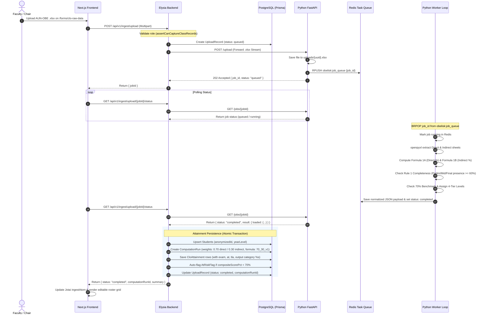
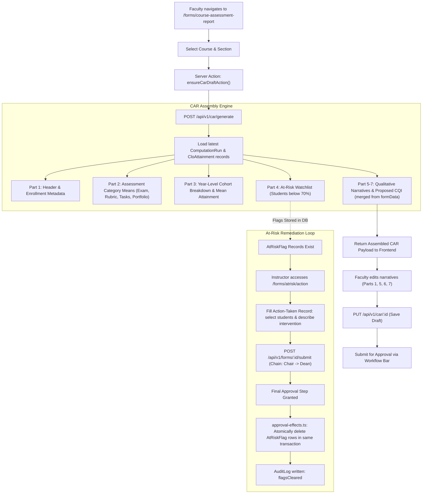
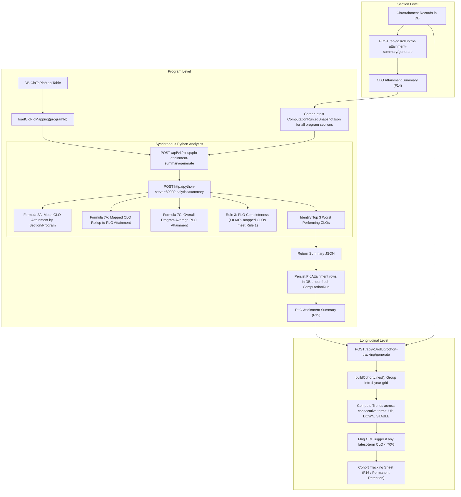
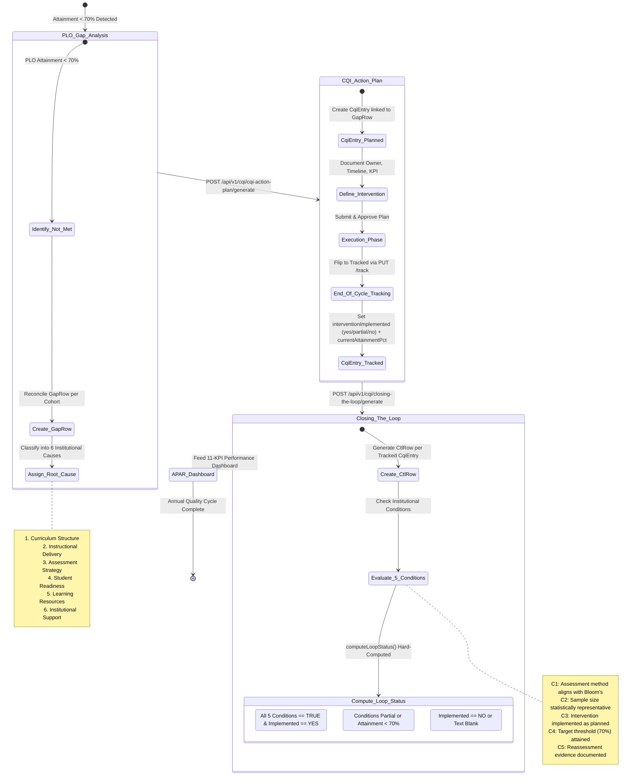
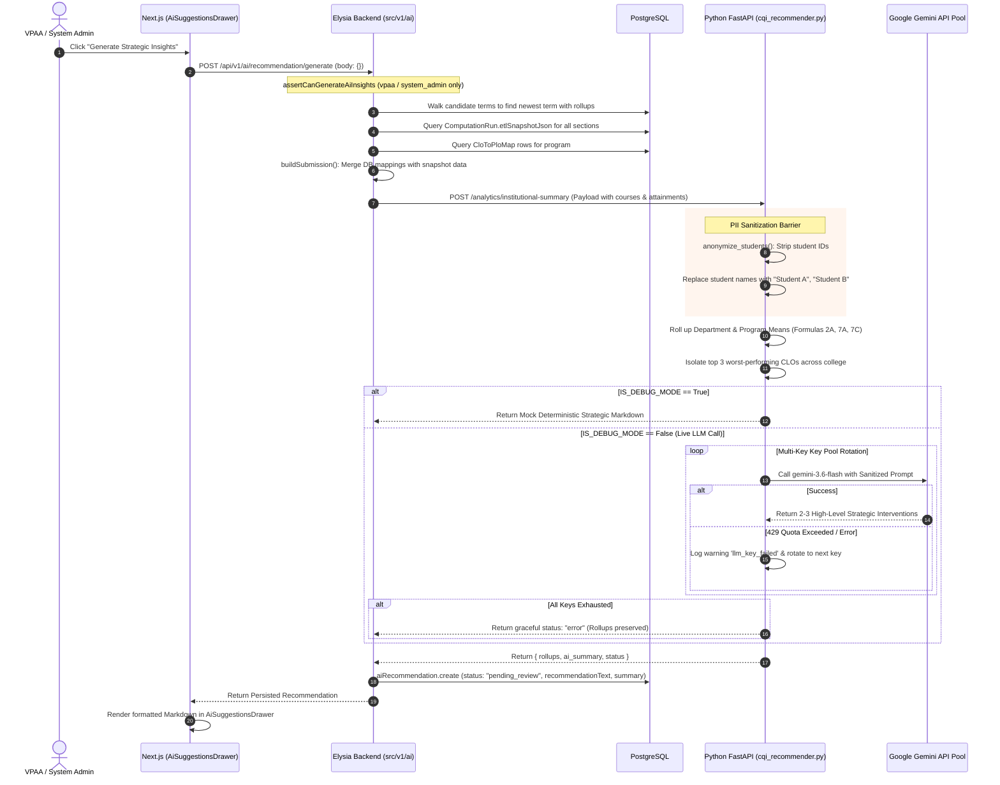
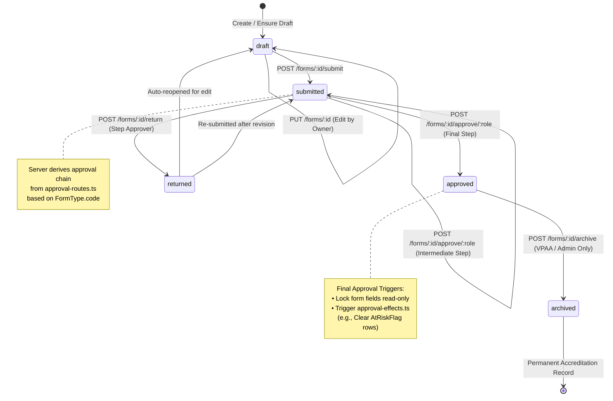

# OBELISK System — End-to-End System Process Explained

> **Document Status:** Comprehensive System Architecture & Multi-Tier Process Reference  
> **Target Audience:** Core Developers, System Architects, Quality Assurance Officers, and Academic Administrators  
> **System Scope:** Outcomes-Based Educational Learning and Intelligent System Kit (OBELISK) for Jose Maria College Foundation, Inc. (JMCFI)  
> **Reference Model:** Aligned with the JMCFI WIN-OBE 37-form Digitization Manual, the Python ETL pure-compute engine, Bun/Elysia backend, and Next.js 16 frontend.

---

## 1. Executive Summary & The Big Picture

OBELISK is a modern, distributed, web-based platform engineered to automate and govern **Outcomes-Based Education (OBE)** compliance at Jose Maria College Foundation, Inc. (JMCFI). It digitizes the entire academic continuous quality improvement (CQI) lifecycle across the **PDCA (Plan–Do–Check–Act)** framework.

Rather than building a monolithic application, OBELISK is designed as a **tri-tier decoupled architecture**:

```
┌───────────────────────────────────────────────────────────────────────────────────┐
│                           TIER 1: FRONTEND WEB APPLICATION                        │
│                           Next.js 16 (React 19) • Port 3000                       │
│  • Adaptive Role-Based Dashboards (Faculty, Chair, Dean, AQAU, VPAA, Admin)       │
│  • 20+ Digital OBE Form Interfaces with Controlled State & TanStack Grids         │
│  • Server Actions Communication & Role-Gated Navigation                           │
│  • Client-Side Jotai State Store & Live Workflow Action Bar                       │
└────────────────────────────────────────┬──────────────────────────────────────────┘
                                         │ HTTP / Cookies / Server Actions
                                         ▼
┌───────────────────────────────────────────────────────────────────────────────────┐
│                           TIER 2: CORE BACKEND & GOVERNANCE                       │
│                           Bun + Elysia • Port 8080                                │
│  • Better-Auth Session Management & Org-Restricted Google OAuth                   │
│  • PostgreSQL Database via Prisma ORM (29 Form Types, Attainments, Audit Logs)    │
│  • Central Role-Based Access Control (RBAC) & Feature Gates                       │
│  • Server-Derived Multi-Tier Approval Chain State Machine                         │
│  • Attainment Orchestration, Action-Taken Clearances, and Archival Compilation    │
└──────────────────┬─────────────────────────────────────────────▲──────────────────┘
                   │                                             │
                   │ (1) Async Multipart File Upload             │ (3) Sync JSON Rollups
                   │ (2) Polling for Ingest Jobs                 │     & LLM Requests
                   ▼                                             │
┌────────────────────────────────────────────────────────────────┴──────────────────┐
│                           TIER 3: PURE-COMPUTE & AI ENGINE                        │
│                           Python FastAPI + Celery/Redis • Port 8000               │
│  • openpyxl Extraction of Authentic AUN-OBE v2 Multi-Sheet Workbooks              │
│  • Pure Mathematical Compute: Formulas 1A, 1B, 2A, 7A, 7C, and Rules 1 & 3       │
│  • Zero-Database, Zero-Auth, Stateless Processing Engine                          │
│  • Redis-Backed Durable Task Queue with Concurrent BRPOP Background Workers       │
│  • Multi-Key Google Gemini AI Pool with Automatic Failover for CQI Advisories     │
└───────────────────────────────────────────────────────────────────────────────────┘
```

### The Three Fundamental Separation Principles

1. **Separation of Compute from Persistence:**
   The Python server owns the authoritative math (Formulas 1A, 1B, 2A, 7A, 7C, Rules 1 & 3) and Excel parsing. It does **not** possess a database, user records, or knowledge of institutional roles. The TypeScript backend is the **sole persister**, recording attainments, computation snapshots, audit logs, and workflow statuses.
2. **Separation of Authentication from Evaluation:**
   Users never communicate directly with the Python compute engine. The Next.js frontend interacts strictly with the Elysia backend via session-authenticated Server Actions. The backend acts as a trusted gateway to the Python service.
3. **Decoupled Workflow & State Verification:**
   OBE forms progress through an immutable state machine (`draft` $\rightarrow$ `submitted` $\rightarrow$ `approved` $\rightarrow$ `archived`, or `returned`). Approval chains are dynamically derived on the server based on the form type code and cannot be altered by client manipulation.

---

## 2. Multi-Tier Responsibility Matrix

| Feature / Responsibility | Tier 1: Frontend (Next.js 16) | Tier 2: Backend (Bun / Elysia) | Tier 3: Compute (Python / FastAPI) |
|---|:---:|:---:|:---:|
| **User Sign-In & Google OAuth** | Renders login & OAuth triggers | Enforces org-domain `hd` claim & sessions | *No involvement* |
| **Role Onboarding & Requests** | Role-request form on `/onboarding` | Stores requests; `system_admin` approval | *No involvement* |
| **Access Control (RBAC)** | Hides routes & navigates via `lib/role-access.ts` | Authoritative gatekeeper (`lib/role-access.ts`) | *No involvement* (trusts caller) |
| **Excel Workbook Ingestion** | Upload dropzone & client file-size check | Streams file to Python; creates `UploadRecord` | Parses `.xlsx` via `openpyxl` in worker |
| **Formula 1A/1B (CLO Attainment)** | Displays calculated attainment read-only | Persists results into `CloAttainment` | Authoritative calculation (`SimpleTransformer`) |
| **Threshold & 4-Tier CLO Standards** | Visualizes status badges (e.g., Exceptional) | Checks $\ge 70\%$ floor; flags `AtRiskFlag` | Evaluates $70\%$ institutional benchmark |
| **Rule 1 (Assessment Completeness)** | Shows incomplete term indicators | Enforces completeness criteria | Verifies Prelim/Midterm/Final presence ($\ge 60\%$) |
| **CLO-to-PLO Mapping Definition** | Dean UI for mapping on `/forms/plan/...` | Stores mappings in DB table `CloToPloMap` | Maps mappings passed into payload |
| **Formula 7A/7C (PLO Attainment)** | Renders PLO radar & bar charts | Feeds DB mappings + snapshots to Python | Rollup engine (`institutional_summary.py`) |
| **Rule 3 (PLO Completeness)** | Visualizes PLO reliability badges | Persists PLO attainment status | Verifies $\ge 60\%$ mapped CLOs meet Rule 1 |
| **Approval Lifecycle & Chain** | Shared workflow bar (`form-workflow.tsx`) | State machine (`state-machine.ts`, `approval-routes.ts`) | *No involvement* |
| **At-Risk Remediation & Clearing** | Student watchlist & Action-Taken form | Final approval deletes `AtRiskFlag` in DB | *No involvement* |
| **AI CQI Recommendation Gen** | `AiSuggestionsDrawer` (VPAA/Admin only) | Gated route (`POST /ai/recommendation/generate`) | Anonymizes PII; Gemini API pool failover |
| **Graduation-Cluster Archival** | Read-only `/archives` cluster browser | Compiles student lifetime history into JSON | *No involvement* |

---

## 3. The Institutional PDCA Cycle in OBELISK

OBELISK categorizes all 37 institutional forms into the four PDCA phases:

```mermaid
flowchart LR
    subgraph PLAN["1. PLAN (Preparation)"]
        F01["Curriculum Map (F01)"]
        F03["Assessment Calendar (F03)"]
        F04["Target Setting Matrix (F04)"]
        F06["Assessment Budget (F06)"]
        F02["Portfolio Roadmap (F02)"]
    end

    subgraph DO["2. DO (Execution & Ingest)"]
        F07["CLO Raw Data (F07 / .xlsx)"]
        INGEST["Async Ingestion Pipeline"]
        SCORES["Student Scores & Attainment"]
    end

    subgraph CHECK["3. CHECK (Evaluation & Rollup)"]
        F13["Course Assessment Report (CAR / F13)"]
        F14["CLO Summary (F14)"]
        F15["PLO Summary (F15)"]
        F16["Cohort Tracking (F16)"]
        INDIRECT["Indirect Instruments (F08, F10-F12, F17-F19)"]
    end

    subgraph ACT["4. ACT (Continuous Improvement)"]
        F22["PLO Gap Analysis (F22)"]
        F23["CQI Action Plan (F23)"]
        F25["Closing the Loop (CTL / F25)"]
        F24["Annual Program Report (APAR / F24)"]
        ATRISK["At-Risk Action-Taken (Clearance)"]
        ARCHIVE["Graduation-Cluster Archival"]
    end

    PLAN --> DO
    DO --> CHECK
    CHECK --> ACT
    ACT -.->|Continuous Feedback| PLAN
```



1. **PLAN Phase:**
   - **Curriculum Map (F01):** Links courses and CLOs to Program Learning Outcomes with I-P-D (Introduced, Practiced, Demonstrated) stages. Computes coverage check (must have stage 'D').
   - **Assessment Calendar (F03):** Establishes institutional milestones (17 non-deletable institutional templates) and department-specific schedules.
   - **Target-Setting Matrix (F04):** Establishes baseline attainment targets (strictly enforced $\ge 70.0\%$ hard floor).
   - **Assessment Budget (F06):** Pre-seeds 12 fixed PDCA budget line items and tracks institutional funding.
2. **DO Phase:**
   - **Class Record Upload (F07 / `clo_raw_data`):** Instructors upload the authoritative AUN-OBE Excel workbook or wide-format CSVs.
   - Computes raw scores into individual student CLO attainment records.
3. **CHECK Phase:**
   - **Course Assessment Report (CAR / F13):** Hub form integrating assessment-category averages (exam, rubric, tasks, portfolio), cohort breakdown, and at-risk student lists.
   - **Rollup Summaries (F14 & F15):** Section-level CLO summaries feed program-level PLO summaries via Python compute.
   - **Cohort Tracking Sheet (F16):** Longitudinal tracking across 4 years with automated trend analysis ($\uparrow, \downarrow, \rightarrow$).
   - **Indirect Instruments:** Mid-cycle summaries (F08), peer observations (F10), exhibition feedback (F11), perception surveys (F12), exit surveys (F17), portfolio reviews (F18), and capstone panels (F19).
4. **ACT Phase:**
   - **PLO Gap Analysis (F22):** Isolates NOT-MET PLO-cohort combinations and categorizes root causes into 6 institutional dimensions.
   - **CQI Action Plan (F23):** Two-phase stateful lifecycle (Planned $\rightarrow$ Tracked).
   - **Closing-the-Loop (CTL / F25):** Evaluates 5 strict compliance conditions to compute whether an educational gap is officially `closed`.
   - **Annual Program Assessment Report (APAR / F24):** Compiles an 11-KPI dashboard; gated on an approved Cohort Tracking Sheet.
   - **Graduation-Cluster Archival:** Compiles cohort lifetime records into permanent read-only evidence snapshots upon graduation.

---

## 4. End-to-End Operational Pipelines Explained

### Pipeline 1: Class Record Ingestion & Attainment Computation (Workbook ETL)

This pipeline processes instructor gradebooks asynchronously to guarantee high throughput and error isolation.



#### Detailed Mathematical Rules in Pipeline 1:

1. **Formula 1A (Direct CLO Attainment):**
   Computed strictly from raw scores, never trusting client or spreadsheet formulas:
   $$\text{direct\_clo\_attainment\_pct} = \frac{\text{Prelim Score} + \text{Midterm Score} + \text{Final Score}}{\text{Prelim Max} + \text{Midterm Max} + \text{Final Max}} \times 100$$
2. **Formula 1B (Indirect CLO Attainment):**
   $$\text{indirect\_clo\_attainment\_pct} = \left(\frac{\text{Likert Rating (1--5)}}{5.0}\right) \times 100$$
3. **Institutional Threshold Standard:**
   $$\text{is\_below\_threshold} = (\text{direct\_clo\_attainment\_pct} < 70.0)$$
4. **4-Tier Institutional Proficiency Standard:**
   - $\ge 85.0\%$: **Exceptional**
   - $70.0\% - 84.9\%$: **Proficient**
   - $60.0\% - 69.9\%$: **Basic**
   - $< 60.0\%$: **Below Basic**
5. **Rule 1: Assessment Term Completeness:**
   Verifies whether scores are recorded across **PRELIM**, **MIDTERM**, and **FINAL** evaluation periods. If any period is missing, `is_record_complete = false`. The section satisfies Rule 1 if $\ge 60.0\%$ of student records are complete.

---

### Pipeline 2: Course Assessment Report (CAR) & At-Risk Intervention Loop

The Course Assessment Report (CAR / Form F13) acts as the operational hub for faculty teaching a class section.



---

### Pipeline 3: Program & Institutional Rollups (F14 $\rightarrow$ F15 $\rightarrow$ F16)

Analytics roll up hierarchically from section CLO attainments to program-wide PLO compliance and longitudinal cohort tracking.



#### Detailed Mathematical Rules in Pipeline 3:

1. **Formula 2A (Section CLO Attainment):**
   $$\text{Mean CLO Attainment} = \frac{\sum \text{direct\_clo\_attainment\_pct}}{\text{Eligible Student Count}}$$
2. **Formula 7A (PLO Attainment Rollup):**
   $$\text{PLO Attainment} = \frac{\sum_{\text{mapped CLOs}} \text{Mean Attainment}}{\text{Total Number of Mapped CLOs}}$$
3. **Formula 7C (Program-Wide PLO Average):**
   $$\text{Program Average PLO} = \frac{\sum_{i=1}^{N} \text{PLO}_i \text{ Attainment}}{N}$$
4. **Rule 3 (PLO Data Reliability Standard):**
   $$\text{plo\_completeness\_pct} = \frac{\text{Count of mapped CLOs satisfying Rule 1}}{\text{Total number of mapped CLOs}} \ge 0.60$$

---

### Pipeline 4: CQI Closed-Loop Lifecycle (F22 $\rightarrow$ F23 $\rightarrow$ F25)

The Continuous Quality Improvement (CQI) loop ensures that academic underperformance triggers verifiable structural interventions.



---

### Pipeline 5: AI-Driven Strategic Advisory & CQI Insights

The AI CQI Advisory provides automated institutional intelligence while maintaining strict student privacy and operational safety.



---

### Pipeline 6: Governance, Workflow State Machine & Approval Routing

All digital OBE forms in OBELISK adhere to an authoritative server-enforced lifecycle.



#### Canonical Approval Routes by Form Category:

1. **Faculty Course Records (`clo_raw_data`, `course_assessment_report`, `clo_attainment_summary`):**
   $$\text{Faculty (Submitter)} \longrightarrow \text{Program Chair (Approve)}$$
2. **Program Planning & CQI (`curriculum_map`, `plo_gap_analysis`, `cqi_action_plan`, `closing_the_loop`):**
   $$\text{Program Chair (Submitter)} \longrightarrow \text{Dean} \longrightarrow \text{AQAU} \longrightarrow \text{VPAA}$$
3. **Assessment Budget (`assessment_budget`):**
   $$\text{Dean (Submitter)} \longrightarrow \text{VPAA (Approve)}$$
4. **Institutional Review & APAR (`annual_program_report`, `institutional_review`):**
   $$\text{Program Chair / Dean} \longrightarrow \text{AQAU} \longrightarrow \text{VPAA}$$

---

### Pipeline 7: Graduation-Cluster Archival Lifecycle

The archival engine preserves permanent accreditation evidence while pruning transactional hot rows from PostgreSQL.

```
┌────────────────────────────────────────────────────────────────────────┐
│ 1. Cluster Candidate Identification (End of Academic Year)             │
│    • Query students where graduationTermId == closing AcademicTerm     │
│    • Includes regular graduates, transferees, and withdrawn students   │
│    • Create GraduationCluster(status = "open")                         │
└───────────────────────────────────┬────────────────────────────────────┘
                                    │
                                    ▼
┌────────────────────────────────────────────────────────────────────────┐
│ 2. Pre-Requisite Verification Gate                                     │
│    • Gated: peoAttainmentCapturedAt must be non-null                   │
│    • Ensures biennial Alumni Tracer (F20) & Employer Surveys (F21)     │
│      have recorded PEO evidence before historical data is frozen       │
└───────────────────────────────────┬────────────────────────────────────┘
                                    │
                                    ▼
┌────────────────────────────────────────────────────────────────────────┐
│ 3. Confirmation to Compile (AQAU or System Admin Only)                 │
│    • Set GraduationCluster(status = "compiling")                       │
│    • Atomic per-student transaction:                                   │
│      a. Compile lifetime CLO/PLO rollups, CAR references, CQI actions  │
│      b. Generate permanent JSON blob -> GraduationClusterEntry         │
│      c. Export full granular audit artifact to storage                 │
│      d. Safely purge hot rows (StudentScore, raw CloAttainment rows)   │
│      e. Preserve PloAttainment, Enrollment, ClassSection metadata      │
└───────────────────────────────────┬────────────────────────────────────┘
                                    │
                                    ▼
┌────────────────────────────────────────────────────────────────────────┐
│ 4. Read-Only Lock & Permanent Storage                                  │
│    • Set GraduationCluster(status = "archived")                        │
│    • Permanent, immutable access via GET /api/v1/archives/:clusterId   │
└────────────────────────────────────────────────────────────────────────┘
```

---

## 5. Frontend Architecture & Interaction Layer

The Next.js 16 frontend is organized around server-first rendering, role adaptation, and clean state isolation.

```
apps/frontend/
├── app/
│   ├── (auth)/login, register      # Guest-only authentication screens
│   ├── onboarding/                 # Role request screen for unassigned accounts
│   ├── (app)/                      # Protected application shell
│   │   ├── dashboard/              # Adaptive single home (role-dashboard.tsx)
│   │   ├── forms/                  # 20+ Digital OBE form routes
│   │   │   ├── clo-raw-data/       # Ingest & roster editing
│   │   │   ├── course-assessment-report/ # 7-part CAR hub
│   │   │   ├── attainment/         # F14, F15, F16 rollups
│   │   │   ├── cqi/                # F22, F23, F25, APAR
│   │   │   ├── plan/               # F01, F03, F04, F06
│   │   │   └── check/              # F08, F10-F12, F17-F19
│   │   ├── submissions/            # "My Submissions" inbox (scope=mine)
│   │   ├── approvals/              # "Pending Approvals" inbox (scope=pending)
│   │   ├── plo-management/         # Dean-only PLO CRUD
│   │   └── archives/               # Read-only graduation-cluster viewer
│   └── proxy.ts                    # Coarse cookie authentication gate
├── components/
│   ├── layout/                     # AppShell, AppSidebar, SiteHeader, NavUser
│   ├── forms/                      # FormWorkflow bar, ClassRecordUpload, Grids
│   ├── dashboard/                  # AiSuggestionsDrawer, StatCards, Shell
│   └── reui/                       # TanStack virtualized DataGrids, Frames
├── lib/
│   ├── role-access.ts              # Synchronized role allow-lists & permissions
│   └── store/                      # Jotai client atoms & async fetchers
└── server/
    ├── api-client.ts               # Server-side actionApi relaying session cookies
    ├── auth.ts                     # requireUser, requireRole guards
    └── actions/                    # "use server" Server Action mutation layer
```

### Key Frontend Mechanisms:

1. **Two-Tier Authentication & Route Protection:**
   - **`proxy.ts` (Next 16 Proxy):** Checks for the presence of the `obelisk-app.session` cookie. Unauthenticated visitors to protected prefixes are immediately redirected to `/login?next=...`.
   - **Server Component Layouts (`requireUser` / `requireRole`):** Authenticates session with backend `GET /api/v1/auth/me`. Verifies authorized roles. Redirects role-less `user` accounts to `/onboarding`.
2. **Server Actions Relay Architecture (`server/actions/`):**
   Client components never invoke direct `fetch` to backend APIs. Instead, they call typed Server Actions (e.g., `submitFormAction`, `generateCarAction`, `trackCqiAction`). The Server Action uses `actionApi` to forward browser cookies and transparently mirrors incoming `Set-Cookie` headers back to the browser.
3. **Controlled State & Jotai Store (`lib/store/`):**
   - Read data and user preferences live in lightweight Jotai atoms.
   - Form tables utilize TanStack Table (`components/reui/data-grid/`) for virtualized rendering of large student cohorts.
   - Form inputs are controlled components that save drafts to local state and commit mutations via Server Actions.
4. **Universal Form Workflow Bar (`form-workflow.tsx`):**
   Embedded across all 20+ form screens. Renders current status badge (`DRAFT`, `SUBMITTED`, `RETURNED`, `APPROVED`, `ARCHIVED`), visualizes the approval step sequence, handles rejection feedback notes, and conditionally displays role-gated action buttons (Submit, Approve, Return, Archive).

---

## 6. Error Handling & System Resilience

OBELISK implements structured error hierarchies across all tiers to prevent uncaught 500 exceptions and data corruption.

```
┌────────────────────────────────────────────────────────────────────────────────────────┐
│                              TIER 3: PYTHON COMPUTE ERRORS                             │
│  OBELISKError (Base)                                                                   │
│  ├── InvalidWorkbook: File unreadable / corrupt openpyxl stream                        │
│  ├── MissingWorksheet: 'Direct CLO' or 'Indirect CLO' missing                          │
│  ├── InvalidTemplate: Cell A1 marker mismatch (AUN-OBE v2 validation)                  │
│  ├── UnsupportedCourseType: Cell B6 not "LECTURE" (e.g., Practicum/Clinical)          │
│  ├── TransformationError: Math calculation division by zero / negative max score       │
│  ├── QueueOverloadedError: Redis job queue exceeds maximum safe capacity               │
│  └── UnauthorizedCaller: Missing or invalid X-Webapp-Secret header                     │
│  * Returned as JSON: { "error_type": "...", "message": "...", "details": {...} }       │
└───────────────────────────────────────────┬────────────────────────────────────────────┘
                                            │ Caught & Wrapped
                                            ▼
┌────────────────────────────────────────────────────────────────────────────────────────┐
│                               TIER 2: BACKEND ERROR MAPPING                            │
│  Prisma / Domain Exceptions -> HTTP Status Codes:                                      │
│  ├── 401 Unauthorized: Invalid session or missing better-auth cookie                   │
│  ├── 403 Forbidden: Caller lacks required role in lib/role-access.ts                   │
│  ├── 404 Not Found: Unknown submission, term, or academic entity                       │
│  ├── 409 Conflict: TargetBelowFloorError (<70%), PloInUseError, Duplicate Submission   │
│  ├── 422 Unprocessable: Schema validation failure (Elysia 't' or body mismatch)       │
│  └── 502 Bad Gateway: PythonServerError (compute microservice unreachable or failed)   │
└───────────────────────────────────────────┬────────────────────────────────────────────┘
                                            │ Handled in Server Action
                                            ▼
┌────────────────────────────────────────────────────────────────────────────────────────┐
│                               TIER 1: FRONTEND RECOVERY                                │
│  Server Action Result Contract:                                                        │
│  • Success: { ok: true, data: T } -> Updates Jotai / Redirects / Displays Success Toast│
│  • Error:   { ok: false, error: string } -> Renders UI Field Error or Destructive Toast│
└────────────────────────────────────────────────────────────────────────────────────────┘
```

---

## 7. Configuration & Environment Variables

### Python Server (`apps/python-server/.env`)
- `OBELISK_APP_HOST`: Host to bind the FastAPI server (default: `0.0.0.0`).
- `OBELISK_APP_PORT`: Port to listen on (default: `8000`).
- `OBELISK_REDIS_HOST` & `OBELISK_REDIS_PORT`: Redis instance address (default: `localhost:6379`).
- `OBELISK_JOB_WORKER_COUNT`: Number of parallel ETL worker coroutines (default: `4`).
- `OBELISK_WEBAPP_SHARED_SECRET`: Shared secret checked via `X-Webapp-Secret` header.
- `OBELISK_LLM_API_KEYS`: JSON array or comma-separated list of Gemini API keys for failover rotation.
- `IS_DEBUG_MODE`: Flag in `cqi_recommender.py` (when `True`, bypasses live Gemini calls with deterministic mock responses).

### Backend Server (`apps/backend/.env`)
- `PORT`: Port to listen on (default: `8080`).
- `DATABASE_URL`: PostgreSQL connection string (supports Neon pooling adapter).
- `BETTER_AUTH_SECRET`: Secret key for signing session tokens and encryption.
- `BETTER_AUTH_URL`: Canonical backend URL (e.g., `http://localhost:8080`).
- `FRONTEND_URL`: Allowed frontend origin for CORS (e.g., `http://localhost:3000`).
- `ORG_EMAIL_DOMAIN`: Hosted domain restriction for Google OAuth (e.g., `jmc.edu.ph`).
- `PYTHON_SERVER_URL`: Base URL for the compute engine (e.g., `http://localhost:8000`).
- `PYTHON_SERVER_SECRET`: Matching shared secret sent in `X-Webapp-Secret`.

### Frontend App (`apps/frontend/.env.local`)
- `NEXT_PUBLIC_API_URL`: Public base URL for client-side API calls (`http://localhost:8080`).
- `INTERNAL_API_URL`: Internal network URL for SSR and Server Actions (`http://localhost:8080`).
- `DEVELOPMENT`: Set to `false` for production auth enforcement; `true` activates dev role switcher.

---

## 8. Summary of System Links & Implementation Paths

### Core Backend Modules
- [Application Entry & Routes](file:///D:/Jetbrains_IDE_Projects/pycharm/Obelisk_FINAL/apps/backend/src/index.ts)
- [Role Access Allow-Lists](file:///D:/Jetbrains_IDE_Projects/pycharm/Obelisk_FINAL/apps/backend/lib/role-access.ts)
- [Workflow State Machine](file:///D:/Jetbrains_IDE_Projects/pycharm/Obelisk_FINAL/apps/backend/lib/forms/state-machine.ts)
- [Form Approval Route Registry](file:///D:/Jetbrains_IDE_Projects/pycharm/Obelisk_FINAL/apps/backend/lib/forms/approval-routes.ts)
- [Submit Gates Engine](file:///D:/Jetbrains_IDE_Projects/pycharm/Obelisk_FINAL/apps/backend/lib/forms/submit-gates.ts)
- [Approval Effects & Clearances](file:///D:/Jetbrains_IDE_Projects/pycharm/Obelisk_FINAL/apps/backend/lib/forms/approval-effects.ts)
- [Ingestion & Attainment Service](file:///D:/Jetbrains_IDE_Projects/pycharm/Obelisk_FINAL/apps/backend/src/v1/ingest/service.ts)
- [Course Assessment Report (CAR) Service](file:///D:/Jetbrains_IDE_Projects/pycharm/Obelisk_FINAL/apps/backend/src/v1/car/service.ts)
- [Rollup & Longitudinal Service](file:///D:/Jetbrains_IDE_Projects/pycharm/Obelisk_FINAL/apps/backend/src/v1/rollup/service.ts)
- [CQI & Closing-the-Loop Service](file:///D:/Jetbrains_IDE_Projects/pycharm/Obelisk_FINAL/apps/backend/src/v1/cqi/service.ts)
- [Plan Phase Setup Forms Service](file:///D:/Jetbrains_IDE_Projects/pycharm/Obelisk_FINAL/apps/backend/src/v1/plan/service.ts)
- [AI CQI Recommendation Service](file:///D:/Jetbrains_IDE_Projects/pycharm/Obelisk_FINAL/apps/backend/src/v1/ai/service.ts)

### Core Frontend Modules
- [Adaptive Role Dashboard Hub](file:///D:/Jetbrains_IDE_Projects/pycharm/Obelisk_FINAL/apps/frontend/app/(app)/dashboard/role-dashboard.tsx)
- [Navigation & Route Registry](file:///D:/Jetbrains_IDE_Projects/pycharm/Obelisk_FINAL/apps/frontend/config/navigation.ts)
- [Universal Form Workflow Bar](file:///D:/Jetbrains_IDE_Projects/pycharm/Obelisk_FINAL/apps/frontend/components/forms/form-workflow.tsx)
- [AI Suggestions Drawer](file:///D:/Jetbrains_IDE_Projects/pycharm/Obelisk_FINAL/apps/frontend/components/dashboard/ai-suggestions-drawer.tsx)
- [Server Actions Mutation Layer](file:///D:/Jetbrains_IDE_Projects/pycharm/Obelisk_FINAL/apps/frontend/server/actions/)
- [Jotai State Store Atoms](file:///D:/Jetbrains_IDE_Projects/pycharm/Obelisk_FINAL/apps/frontend/lib/store/)

### Core Python Compute Modules
- [FastAPI Main Application](file:///D:/Jetbrains_IDE_Projects/pycharm/Obelisk_FINAL/apps/python-server/app/main.py)
- [Redis Background Worker Loop](file:///D:/Jetbrains_IDE_Projects/pycharm/Obelisk_FINAL/apps/python-server/app/workers/worker.py)
- [Workbook Openpyxl Extractor](file:///D:/Jetbrains_IDE_Projects/pycharm/Obelisk_FINAL/apps/python-server/app/etl/extract/extractor.py)
- [Mathematical Transformer (Formulas 1A/1B)](file:///D:/Jetbrains_IDE_Projects/pycharm/Obelisk_FINAL/apps/python-server/app/etl/transform/transformer.py)
- [Institutional Analytics Engine (Formulas 2A/7A/7C)](file:///D:/Jetbrains_IDE_Projects/pycharm/Obelisk_FINAL/apps/python-server/app/analytics/institutional_summary.py)
- [Multi-Key Gemini AI Recommender](file:///D:/Jetbrains_IDE_Projects/pycharm/Obelisk_FINAL/apps/python-server/app/analytics/cqi_recommender.py)
