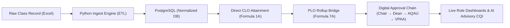
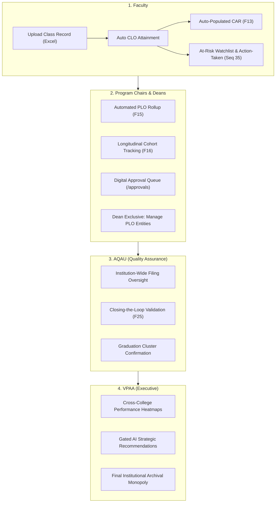

# OBELISK: System Purpose and Value Mapping Report
**Outcomes-Based Educational Learning and Intelligent System Kit**  
**Jose Maria College Foundation, Inc. (JMCFI)**  
**Document Code:** `SYS-DOC-SPVM-01`  
**Cross-Reference:** Chapter 1 Introduction & [`system-docs/Synchronization_of_documents_and_system.md`](./Synchronization_of_documents_and_system.md)

---

## 1. The Core "Why" (Elevator Pitch)

Jose Maria College Foundation, Inc. (JMCFI) operates under the comprehensive **WIN-OBE Assessment Plan**, an institutional quality framework encompassing 37 interrelated assessment forms across the Plan-Do-Check-Act (PDCA) cycle and an 8-level outcomes hierarchy:

$$\text{Institutional Mission/Vision} \longrightarrow \text{Core Values} \longrightarrow \text{Institutional Outcomes (IO)} \longrightarrow \text{PEOs} \longrightarrow \text{PLOs} \longrightarrow \text{CLOs} \longrightarrow \text{TLA/AT} \longrightarrow \text{Rubric Scoring}$$

### The Problem
Historically, this rigorous framework was executed through **manual, spreadsheet-based workflows**. Faculty computed attainment values in disconnected Excel files, copy-pasting figures across spreadsheets and passing paper or digital copies through informal channels to Program Chairs, Deans, the Academic Quality Assurance Unit (AQAU), and the Vice President for Academic Affairs (VPAA). This process suffered from:
1. **Compounding Human Error:** Formulas were vulnerable to accidental tampering, broken references, and manual transcription errors.
2. **Operational Latency:** Multi-handoff consolidation took weeks, meaning student learning deficiencies were detected long after the semester ended.
3. **Executive Blindspots:** Institutional leaders (Deans, AQAU, VPAA) had zero real-time visibility into OBE compliance status until the manual consolidation chain concluded.
4. **Reactive Accreditation Scramble:** Documentation required for CHED CMO No. 46, s. 2012 and accreditation audits (e.g., PACUCOA) had to be manually reconstructed from fragmented binders.

### The Solution: OBELISK
**OBELISK exists to replace manual spreadsheet chaos with a centralized, automated, and institution-aligned digital pipeline.** It establishes a single source of truth where raw grade data is ingested once, independently recomputed against institutional benchmarks ($\ge 70\%$ floor, 70/30 composite ratio), and automatically cascaded from Course Learning Outcomes (CLOs) to Program Learning Outcomes (PLOs). It enforces a role-based digital approval hierarchy that guarantees zero skipped steps, delivers real-time dashboards to all institutional stakeholders, and augments quality assurance through an advisory, privacy-first AI decision-support layer.



---

## 2. Feature-to-Objective Mapping

| Capstone Specific Objective | Codebase Implementation & Components | File & Architectural Anchor | Concrete System Behavior |
| :--- | :--- | :--- | :--- |
| **Objective 1: Digitize & Centralize the 37-Form Workflow**<br>Eliminate spreadsheet-based form accomplishment into a single platform across the PDCA cycle. | • Forms Module & State Machine<br>• Approval Routing Registry (29 registered form codes)<br>• Adaptive Form Workflow Component (`FormWorkflow`) | • [`apps/backend/prisma/schema/05-forms.prisma`](../apps/backend/prisma/schema/05-forms.prisma)<br>• [`apps/backend/lib/forms/approval-routes.ts`](../apps/backend/lib/forms/approval-routes.ts)<br>• [`apps/backend/src/v1/forms/service.ts`](../apps/backend/src/v1/forms/service.ts)<br>• [`apps/frontend/components/forms/form-workflow.tsx`](../apps/frontend/components/forms/form-workflow.tsx) | Digitizes PLAN forms (F01 Curriculum Map, F03 Calendar, F04 Target Setting, F06 Budget), DO/CHECK instruments (F08, F10-F12, F17-F19), CAR (F13), Rollup (F14-F16), and CQI (F22-F25, Action-Taken). Enforces valid lifecycle transitions (`draft` $\to$ `submitted` $\to$ `under_review` $\to$ `approved` / `returned_with_comments` $\to$ `archived`). |
| **Objective 2: Automate Attainment Computation & Rollup**<br>Automate CLO-to-PLO computation and eliminate copy-paste consolidation errors using the 70% threshold and 70/30 weighting. | • Python ETL Extraction & Transformation Engine<br>• Attainment Persistence & Validation<br>• Dynamic CLO-to-PLO Mapping Bridge | • [`apps/python-server/app/etl/extract/extractor.py`](../apps/python-server/app/etl/extract/extractor.py)<br>• [`apps/python-server/app/etl/transform/transformer.py`](../apps/python-server/app/etl/transform/transformer.py)<br>• [`apps/backend/lib/validators/attainment.ts`](../apps/backend/lib/validators/attainment.ts)<br>• [`apps/backend/src/v1/rollup/service.ts`](../apps/backend/src/v1/rollup/service.ts) | **Formula 1A:** `_compute_direct_clo_attainment` independently parses Prelim, Midterm, and Final scores from raw workbooks via `openpyxl`, ignoring untrusted spreadsheet formulas. Verifies Rule-1 completeness ($\ge 60\%$ section completeness).<br>**Formula 7A:** `PloSummaryService.loadCloPloMapping` queries `prisma.cloToPloMap` dynamically, computes mapped CLO means, and persists official `PloAttainment` records.<br>**Floor Enforcement:** Rejects target configurations below $70.0\%$ (`TargetBelowFloorError` mapped to HTTP 409). |
| **Objective 3: Role-Based Digital Approval Chain & Dashboards**<br>Enforce institutional routing (Faculty $\to$ Chair $\to$ Dean $\to$ AQAU $\to$ VPAA) with real-time submission tracking. | • RBAC Assertion Middleware<br>• Transactional Approval Effects (`clearAtRiskFlagsOnApproval`)<br>• Adaptive Role-Specific Next.js Dashboards | • [`apps/backend/lib/role-access.ts`](../apps/backend/lib/role-access.ts)<br>• [`apps/backend/lib/forms/approval-effects.ts`](../apps/backend/lib/forms/approval-effects.ts)<br>• [`apps/frontend/app/(app)/dashboard/`](../apps/frontend/app/(app)/dashboard/)<br>• [`apps/frontend/server/actions/approvals.ts`](../apps/frontend/server/actions/approvals.ts) | Prevents skipping approver levels. Faculty are strictly preparers; Program Chairs and Deans review/approve; AQAU validates institution-wide filings; VPAA exercises archive and institutional review monopoly. Submissions cannot be approved unless prerequisite steps pass. Remediation approvals atomically delete student flags inside PostgreSQL transactions. |
| **Objective 4: Automated Analytics & Accreditation Reporting**<br>Generate attainment summaries, longitudinal cohort trends, and gap analyses from live data. | • Rollup Analytics Service<br>• CQI Gap & Closing-the-Loop Engine<br>• Longitudinal Cohort Trend Visualizations | • [`apps/backend/src/v1/rollup/compute.ts`](../apps/backend/src/v1/rollup/compute.ts)<br>• [`apps/backend/src/v1/cqi/compute.ts`](../apps/backend/src/v1/cqi/compute.ts)<br>• [`apps/frontend/components/charts/attainment-charts.tsx`](../apps/frontend/components/charts/attainment-charts.tsx)<br>• [`apps/frontend/components/charts/cqi-charts.tsx`](../apps/frontend/components/charts/cqi-charts.tsx) | Computes cohort trends ($\uparrow, \downarrow, \rightarrow$) across terms in `buildCohortLines`. Evaluates F25 Closing-the-Loop status server-side (`computeLoopStatus`), requiring all 5 criteria and verified intervention before marking a CQI cycle as `closed`. Surfaces root causes across 6 accredited categories (curriculum, delivery, assessment, student, facility, policy). |
| **Objective 5: AI-Assisted Decision Support for CQI**<br>Identify students below 70% threshold, flag underperforming outcomes, and produce contextual CQI recommendations. | • At-Risk Watchlist Engine<br>• Python Institutional Summary & Gap Aggregator<br>• CQI Recommender Service & Drawer | • [`apps/backend/src/v1/atrisk/service.ts`](../apps/backend/src/v1/atrisk/service.ts)<br>• [`apps/python-server/app/analytics/institutional_summary.py`](../apps/python-server/app/analytics/institutional_summary.py)<br>• [`apps/python-server/app/analytics/cqi_recommender.py`](../apps/python-server/app/analytics/cqi_recommender.py)<br>• [`apps/frontend/components/dashboard/ai-suggestions-drawer.tsx`](../apps/frontend/components/dashboard/ai-suggestions-drawer.tsx) | Auto-derives `AtRiskFlag` for any student failing the 70% CLO floor upon raw upload. Aggregates worst-performing CLOs across sections, departments, and programs via `compute_summary_only`. Feeds anonymized attainment gaps into Gemini with structured system prompts, streaming advisory CQI action proposals directly into the executive dashboard. |

---

## 3. Direct User Benefits: Role-by-Role Breakdown



### 1. Faculty
* **Elimination of Tedious Encoding:** Faculty no longer spend dozens of hours manually transferring grades into separate CLO assessment spreadsheets. They upload their standard class record once at [`/forms/clo-raw-data`](../apps/frontend/app/(app)/forms/clo-raw-data/page.tsx). The backend and Python ETL parse the entire roster, validating exam scores and rubric marks automatically.
* **Instant Course Assessment Report (CAR / F13):** Instead of manually calculating means, Part 3 (CLO Attainment Summaries) and Part 4 (At-Risk Watchlist) of the Course Assessment Report are auto-generated from database rows ([`apps/backend/src/v1/car/service.ts`](../apps/backend/src/v1/car/service.ts)).
* **Proactive At-Risk Remediation:** Students falling below the 70% benchmark are automatically flagged. Faculty use the dedicated Action-Taken screen ([`/forms/cqi/action-taken`](../apps/frontend/app/(app)/forms/cqi/action-taken/page.tsx)) to log corrective actions (tutoring, re-assessment, advising), which seamlessly route to the Program Chair for approval and clear the watchlist.
* **Personalized Section Visibility:** The [`FacultyDashboard`](../apps/frontend/app/(app)/dashboard/faculty-dashboard.tsx) provides instant feedback on class section attainment distributions, upload statuses, and CAR submission progress.

### 2. Program Chairs & Deans
* **Program Chairs:**
  * **Automated Aggregation & PLO Rollup:** Eradicates the manual collation of dozens of course spreadsheets. The system combines course-level CLOs using active curriculum mappings to generate Form 15 (PLO Attainment Summary) with zero math errors ([`PloSummaryService`](../apps/backend/src/v1/rollup/service.ts)).
  * **Frictionless Workflow Governance:** A centralized review queue ([`/approvals`](../apps/frontend/app/(app)/approvals/page.tsx)) allows Program Chairs to review, comment on, and endorse submissions with full audit histories.
  * **Program Health Dashboard:** The [`ProgramChairDashboard`](../apps/frontend/app/(app)/dashboard/program-chair-dashboard.tsx) visualizes target vs. actual PLO attainment, longitudinal cohort trends (F16), and curriculum map coverage gaps across the entire degree program.
* **Deans:**
  * **Sole Custody of Academic Standards:** Under institutional policy, only Deans can create, edit, or retire Program Learning Outcomes ([`PLO_MANAGEMENT_ROLES = ["dean"]`](../apps/backend/lib/role-access.ts); there is no administrator bypass).
  * **Inter-Program Performance Monitoring:** The [`DeanDashboard`](../apps/frontend/app/(app)/dashboard/dean-dashboard.tsx) displays cross-program comparisons, college-wide cohort trajectories, and assessment budget allocations (F06) against actual execution.

### 3. AQAU (Academic Quality Assurance Unit)
* **Real-Time Institutional Compliance Radar:** Instead of waiting for semester-end paper submissions, AQAU has real-time visibility across all programs via the [`AqauDashboard`](../apps/frontend/app/(app)/dashboard/aqau-dashboard.tsx). The `FormStatusDonut` tracks every filing across PLAN, DO, CHECK, and ACT stages.
* **Automated Closing-the-Loop Enforcement:** AQAU is safeguarded against rubber-stamped compliance. The system algorithmically evaluates Form 25 (Closing-the-Loop) through [`computeLoopStatus`](../apps/backend/src/v1/cqi/compute.ts). A loop cannot be marked `closed` unless five strict criteria (evidence verified, target evaluated, analysis completed, action implemented, reassessment planned) are verified true.
* **Accreditation Readiness:** Long-term cohort tracking (F16) and institutional CAPA plans (F27) are maintained in structured relational tables, instantly ready for CHED or PACUCOA accreditation visits without last-minute manual consolidation.

### 4. VPAA (Vice President for Academic Affairs)
* **High-Level Executive Decision Support:** The [`VpaaDashboard`](../apps/frontend/app/(app)/dashboard/vpaa-dashboard.tsx) summarizes university-wide CQI completion, institutional CAPA status, and systemic resource allocations across colleges.
* **Exclusive Authority Over Strategic AI Insights:** Only the VPAA (and system admin) holds the authorization to trigger institution-wide generative AI analyses ([`assertCanGenerateAiInsights`](../apps/backend/lib/role-access.ts)), ensuring institutional recommendations are initiated exclusively at the leadership level.
* **Institutional Archival Monopoly:** Once forms successfully traverse the entire approval hierarchy, final permanent archiving is strictly reserved for the VPAA ([`FEATURE_ACCESS.archive = ["vpaa", "system_admin"]`](../apps/backend/lib/role-access.ts)), ensuring sovereign institutional sign-off on historical academic records.

---

## 4. The AI Defense: Safe, Advisory, and Evidence-Based Decision Support

When presenting OBELISK to the evaluation panel, the inclusion of the Python microservice and Google Gemini LLM is defended on **four technical pillars**:

```
                       ┌────────────────────────────────────────────────────────┐
                       │                   VPAA Request                         │
                       │     POST /api/v1/ai/recommendation/generate           │
                       └──────────────────────────┬─────────────────────────────┘
                                                  │
                                                  ▼
                       ┌────────────────────────────────────────────────────────┐
                       │          Backend RBAC & Deterministic Aggregation      │
                       │    • Role Gate: VPAA only (403 for other roles)         │
                       │    • compute_summary_only: Gaps computed mathematically │
                       └──────────────────────────┬─────────────────────────────┘
                                                  │
                                                  ▼
                       ┌────────────────────────────────────────────────────────┐
                       │             PII Scrubbing & Anonymization              │
                       │   anonymize_students(): "Student A", ID -> null        │
                       └──────────────────────────┬─────────────────────────────┘
                                                  │
                                                  ▼
                       ┌────────────────────────────────────────────────────────┐
                       │             Google Gemini API (Failover Pool)          │
                       │     Generates Qualitative CQI Narrative Options        │
                       └──────────────────────────┬─────────────────────────────┘
                                                  │
                                                  ▼
                       ┌────────────────────────────────────────────────────────┐
                       │          Database Isolation & Human-in-the-Loop        │
                       │  • Writes ONLY to AiRecommendation (pending_review)   │
                       │  • Zero access to StudentScore or Attainment tables    │
                       │  • Displayed with advisory disclaimers in UI           │
                       └────────────────────────────────────────────────────────┘
```

### 1. Strictly Advisory Capacity (Zero Autonomous Authority)
* **The AI never grades, assesses, or alters student records:** The LLM cannot mutate `StudentScore`, `CloAttainment`, or `PloAttainment`. 
* **Isolated Data Sinks:** The backend AI service writes exclusively to a single table: `AiRecommendation` ([`apps/backend/prisma/schema/08-monitoring.prisma`](../apps/backend/prisma/schema/08-monitoring.prisma)), with the initial status stamped as `pending_review` ([`apps/backend/src/v1/ai/service.ts`](../apps/backend/src/v1/ai/service.ts)).
* **Mandatory Human-in-the-Loop:** In the frontend [`AiSuggestionsDrawer`](../apps/frontend/components/dashboard/ai-suggestions-drawer.tsx), suggestions are displayed alongside explicit disclaimers:
  > *"AI-generated suggestions — validate against institutional policy before acting. Gap figures are computed from persisted attainment data (70% institutional floor)."*
  The suggestions serve as qualitative inspiration for Program Chairs, Deans, and the VPAA when drafting CQI action plans, not as binding institutional policies.

### 2. Full Compliance with the Data Privacy Act of 2012 (RA 10173)
* **Pre-Prompt PII Scrubbing:** Before any prompt is compiled or transmitted to external AI providers, the Python service executes `anonymize_students()` ([`apps/python-server/app/analytics/cqi_recommender.py`](../apps/python-server/app/analytics/cqi_recommender.py)).
* **Tokenized Anonymization:** Real student names are stripped and replaced with generic tokens (`Student A`, `Student B`, `Student C`), and student identification numbers are permanently nulled (`record.student_id = None`). 
* **Zero PII Leakage:** The external LLM receives only aggregated statistical patterns (e.g., *"CLO2: 8 of 32 students below threshold, 58.4% average"*). No student's name, email, or institutional ID is ever exposed across the internet.

### 3. Separation of Deterministic Analytics from Generative Suggestions
* **Hallucination Prevention:** The numerical data underlying all AI insights is computed deterministically in pure Python/TypeScript algorithms (`compute_summary_only` in [`institutional_summary.py`](../apps/python-server/app/analytics/institutional_summary.py)). The system identifies the worst-performing CLOs and attainment gaps through arithmetic aggregations.
* **Dual-Pane Presentation:** The UI displays the factual numbers in a dedicated **"Key Gaps (computed)"** table directly above the LLM narrative ([`AiSuggestionsDrawer`](../apps/frontend/components/dashboard/ai-suggestions-drawer.tsx)). Decision-makers inspect the exact verified numbers regardless of what the LLM outputs.

### 4. Enterprise Resilience and Key Rotation Architecture
* **Debug & Offline Isolation:** The Python service defaults to `IS_DEBUG_MODE = True` ([`cqi_recommender.py`](../apps/python-server/app/analytics/cqi_recommender.py)), guaranteeing that unit tests, local demonstrations, and panel defenses run deterministically with pre-validated responses without depending on active internet connections or incurring API billing.
* **Multi-Key Failover Pool:** For production deployment, the architecture features a multi-key failover rotation pool ([`apps/python-server/app/core/config.py`](../apps/python-server/app/core/config.py) and [`cqi_recommender.py`](../apps/python-server/app/analytics/cqi_recommender.py)). If a Google Gemini API key hits rate limits or quota boundaries, the engine masks the key, logs the attempt, and automatically fails over to subsequent keys in the pool without interrupting executive user workflows.

---

## 5. Summary Matrix: Connecting Needs, Code, and Stakeholder Value

| Institutional Problem (Spreadsheets) | Codebase Implementation | Delivered Stakeholder Value |
| :--- | :--- | :--- |
| **37 disconnected spreadsheets & forms** | Elysia backend & PostgreSQL normalized schema across 14 modular models (`05-forms`, `07-attainment`). | Single unified platform; eliminates manual copy-paste consolidation; ensures structured historical persistence. |
| **Formula tampering & math discrepancies** | Python ETL (`openpyxl`) + independent Formula 1A/7A recomputation engine; hardcoded $\ge 70\%$ floor. | Complete mathematical rigor; 100% independent verification; eliminates erroneous grade calculations. |
| **Skipped approval steps & informal handoffs** | Canonical state machine + RBAC approval routing (`approval-routes.ts`, `role-access.ts`). | Guaranteed institutional hierarchy; unskippable review steps; immutable audit logs for accreditation. |
| **Late detection of at-risk students** | Automatic derivation of `AtRiskFlag` on upload; transactional Action-Taken remediation workflow. | Timely student interventions; structured remediation records; evidence-based closing of the CQI loop. |
| **Executive blindspots during semester** | Jotai-driven role dashboards + PII-scrubbed Google Gemini AI strategic advisory module. | Real-time compliance visibility for Chairs, Deans, AQAU, and VPAA; proactive, data-driven academic governance. |
